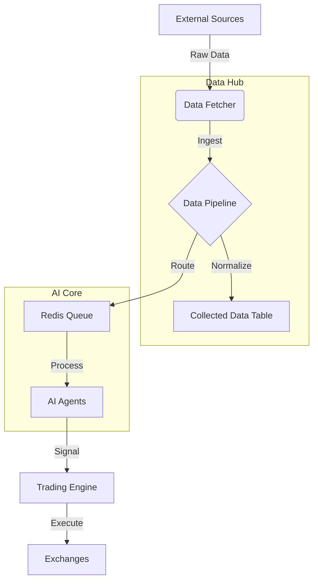

# TitanGold Architecture Documentation

This document provides a high-level overview of the TitanGold platform architecture, detailing its core components, data flow, and security model.

## 1. System Overview

TitanGold is a professional-grade AI trading platform designed to:
1.  **Ingest** real-time data from multiple sources (Exchanges, News, On-chain).
2.  **Process** and normalize this data via a robust pipeline.
3.  **Analyze** conditions using specialized AI agents.
4.  **Execute** trades automatically based on risk-managed strategies.

## 2. Core Components

### 2.1 Frontend (`/components`)
-   **Framework**: React 18, TypeScript, Vite.
-   **State Management**: React Context (Auth, WebSocket, AI).
-   **UI Library**: Tailwind CSS, Lucide Icons, Recharts.
-   **Key Modules**:
    -   **AI Center**: Dashboard for agent management.
    -   **Data Hub**: interface for managing data sources and logs.
    -   **Trading Terminal**: Real-time chart and order entry.

### 2.2 Backend (`/backend`)
-   **Runtime**: Node.js v18+.
-   **Framework**: Express.js.
-   **Database**: PostgreSQL 15+ (Main storage), Redis (Caching/Queue).
-   **Key Services**:
    -   **Data Pipeline**: Orchestrates ingestion and normalization.
    -   **AI Engine**: Runs agent logic in isolation.
    -   **Trading Engine**: Executes orders and manages portfolio state.

### 2.3 Data Hub (`/backend/services`)
Centralized system for all external data.
-   **Sources**: Configurable endpoints (BINANCE, CRYPTOCOMPARE, RSS).
-   **Categories**: Logical grouping (MARKET, SENTIMENT, ON_CHAIN).
-   **Pipeline**: Normalization -> Validation -> Routing.

## 3. Data Flow Architecture

## 4. Security Architecture

### 4.1 Authentication
-   **JWT**: Stateless authentication with short-lived access tokens and refresh tokens.
-   **Sessions**: Controlled via Redis for easy revocation.

### 4.2 Data Security
-   **Credential Encryption**: All API keys (e.g., exchange keys) are encrypted using AES-256-GCM before storage.
-   **Master Key**: A server-side environment variable `MASTER_KEY` is required for encryption operations.

### 4.3 Input Protection
-   **Validation**: Zod schemas for all API inputs.
-   **Rate Limiting**: Redis-backed sliding window rate limiter per IP.

## 5. Technology Stack

| Component | Technology | Description |
| :--- | :--- | :--- |
| **Language** | TypeScript / JavaScript | Full-stack usage |
| **Server** | Express.js | REST API |
| **Database** | PostgreSQL | Relational data |
| **Cache/Queue** | Redis | Rate limiting, Pub/Sub |
| **Testing** | Jest, Supertest | Unit & Integration |
| **E2E** | Playwright | End-to-End testing |
