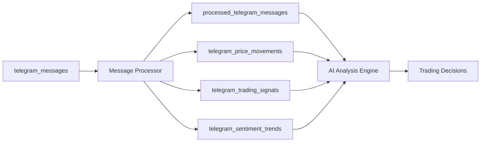

# 📊 Telegram Data Pipeline - Complete Guide

**Date:** 2026-02-16  
**Status:** ✅ Production Ready  
**Version:** 1.0.0

## Overview

The Telegram Data Pipeline automatically processes raw Telegram messages and transforms them into structured trading data. It's the **second stage** in the TitanGold data flow:

```
Telegram → Collector → [Data Pipeline] → AI Analysis → Trading Decisions
```

## Architecture

### System Components



### Services

| Service | PM2 ID | Purpose | Status |
|---------|--------|---------|--------|
| `telegram-collector` | 13 | Collect raw messages | ✅ Running |
| `telegram-processor` | 15 | Process & analyze messages | ✅ Running |
| `telegram-collector-monitor` | 14 | Health monitoring | ✅ Running |

## Database Schema

### 1. processed_telegram_messages (Main Table)

Primary table storing all processed messages with extracted insights.

**Key Fields:**
- `raw_message_id`: Link to original message
- `language`: Detected language (fa/en)
- `cleaned_text`: Text without emojis/URLs
- `keywords[]`: Extracted keywords
- `mentioned_assets[]`: Detected assets (BTC, GOLD, etc.)
- `extracted_prices JSONB`: Price data
- `sentiment`: positive/negative/neutral
- `sentiment_score`: -1.0 to 1.0
- `news_type`: price_alert, analysis, market_update
- `importance_level`: critical, high, medium, low
- `is_actionable`: Can trigger trades
- `processing_duration_ms`: Performance metric

**Indexes:** 15 indexes including GIN for full-text search

### 2. telegram_price_movements

Extracted price information for tracking asset movements.

**Fields:**
- `asset_symbol`: BTC, GOLD, USD, etc.
- `price`: Extracted price value
- `currency`: USD, IRR, EUR, AED
- `price_type`: current, target, support, resistance
- `change_percent`: Price change
- `timeframe`: 1h, 24h, 7d

### 3. telegram_trading_signals

Actionable trading signals identified from messages.

**Fields:**
- `signal_type`: buy, sell, hold, alert
- `asset_symbol`: Target asset
- `entry_price`, `target_price`, `stop_loss`
- `strength`: 0.0 to 1.0
- `confidence`: 0.0 to 1.0
- `risk_reward_ratio`
- `status`: active, executed, expired

### 4. telegram_sentiment_trends

Aggregate sentiment analysis over time periods.

**Fields:**
- `asset_symbol`: Asset being analyzed
- `timeframe`: 1h, 6h, 24h
- `message_count`, `positive_count`, `negative_count`
- `avg_sentiment_score`
- `dominant_sentiment`
- `top_keywords[]`

## Processing Pipeline

### Step 1: Language Detection

```javascript
detectLanguage(text) → 'fa' | 'en'
```

Uses character frequency analysis to determine primary language.

### Step 2: Text Cleaning

Removes:
- ✂️ URLs
- ✂️ Mentions (@username)
- ✂️ Emojis
- ✂️ Extra whitespace

### Step 3: Entity Extraction

**Assets Detected:**
- English: BTC, ETH, USDT, GOLD, DOLLAR, EURO, DIRHAM, BITCOIN, ETHEREUM
- Persian: دلار, یورو, طلا, سکه, بیت کوین, اتریوم, درهم

**Currencies:**
- USD, IRR, EUR, AED, TRY

**Prices:**
- Pattern matching: "50,000 USD", "$1,234.56", "۱۲۳۴۵۶ تومان"
- Multiple formats supported

### Step 4: Keyword & Hashtag Extraction

- Extracts up to 10 most important keywords
- Filters stopwords (the, a, با, از, etc.)
- Captures all hashtags
- Identifies URLs

### Step 5: Sentiment Analysis

**Method:** Keyword-based scoring

**Positive Keywords:**
- English: good, great, bullish, rise, up, profit, gain
- Persian: خوب, عالی, صعودی, سود, افزایش

**Negative Keywords:**
- English: bad, poor, bearish, fall, down, loss, drop
- Persian: بد, ضعیف, نزولی, ضرر, کاهش

**Output:**
- `sentiment`: positive/negative/neutral
- `sentiment_score`: -1.0 to 1.0
- `confidence_score`: 0.0 to 1.0

### Step 6: News Classification

**news_type:**
- `price_alert`: Price mentions/updates
- `analysis`: Technical/fundamental analysis
- `market_update`: General market info
- `news`: News reports
- `general`: Other content

**news_category:**
- `crypto`: Bitcoin, Ethereum, USDT
- `gold`: Gold, gold coin
- `forex`: USD, EUR, foreign exchange
- `economic`: Economic indicators
- `political`: Political news
- `general`: Uncategorized

### Step 7: Importance Assessment

**Scoring Factors:**
- Channel priority (high/normal/low)
- Price mentions (+2 points)
- Multiple assets (+1 point)
- Strong sentiment (+1 point)

**Levels:**
- `critical`: Score ≥ 4
- `high`: Score ≥ 2
- `medium`: Score ≥ 1
- `low`: Score < 1

### Step 8: Actionability Detection

A message is **actionable** if:
- Importance level is `critical` OR `high`
- AND at least one asset is mentioned

## Performance Metrics

### Current Stats (as of 2026-02-16)

```sql
SELECT * FROM telegram_pipeline_stats;
```

| Metric | Value |
|--------|-------|
| Total Messages | 250+ |
| Processed | 100% |
| Pending | 0 |
| Failed | 0 |
| Actionable | 8 |
| Avg Processing Time | 0.092ms |
| Channels with Data | 6 |

### Processing Configuration

- **Batch Size:** 150 messages per cycle (configurable via `TELEGRAM_PROCESSOR_BATCH_SIZE`)
- **Interval:** 15 seconds (configurable via `TELEGRAM_PROCESSOR_INTERVAL_SECONDS`)
- **Order:** Oldest unprocessed first (FIFO), so no message is left behind when bursts occur
- **No message loss:** If more than one batch arrives between cycles, the next cycle(s) process the rest; nothing is dropped
- **Concurrency:** Parallel processing within each batch
- **Error Handling:** Automatic retry & logging

## API & Queries

### Check Pipeline Stats

```bash
curl http://127.0.0.1:3002/api/telegram-processor/stats
```

Or directly:
```sql
SELECT * FROM telegram_pipeline_stats;
```

### Top Mentioned Assets (24h)

```sql
SELECT * FROM telegram_top_mentioned_assets;
```

### Recent Actionable Messages

```sql
SELECT 
    cleaned_text,
    mentioned_assets,
    sentiment,
    importance_level,
    news_type
FROM processed_telegram_messages
WHERE is_actionable = true
ORDER BY created_at DESC
LIMIT 10;
```

### Messages by Sentiment

```sql
SELECT 
    sentiment,
    importance_level,
    news_category,
    COUNT(*) as total
FROM processed_telegram_messages
GROUP BY sentiment, importance_level, news_category
ORDER BY total DESC;
```

### Price Movements Today

```sql
SELECT 
    asset_symbol,
    AVG(price) as avg_price,
    MIN(price) as min_price,
    MAX(price) as max_price,
    COUNT(*) as mentions
FROM telegram_price_movements
WHERE created_at > NOW() - INTERVAL '24 hours'
GROUP BY asset_symbol
ORDER BY mentions DESC;
```

## Operations

### Start Processor

```bash
pm2 start telegram-processor
# Or
node telegram-collector/services/messageProcessor.js
```

### Stop Processor

```bash
pm2 stop telegram-processor
```

### Restart Processor

```bash
pm2 restart telegram-processor
```

### View Logs

```bash
pm2 logs telegram-processor --lines 50
```

### Monitor Performance

```bash
pm2 monit
```

### Manual Processing Test

```bash
cd /home/ubuntu/webapp/TitanGold/telegram-collector
node services/messageProcessor.js
```

## Configuration

Environment variables (optional):

```bash
# Collector: channel polling (default: enabled; set to false to disable)
TELEGRAM_POLLING_ENABLED=true

# Enable/disable processor
TELEGRAM_PROCESSOR_ENABLED=true

# Batch size per cycle (default 150; more = fewer cycles for bursts)
TELEGRAM_PROCESSOR_BATCH_SIZE=150

# Processing interval in seconds (default 15; smaller = nearer realtime)
TELEGRAM_PROCESSOR_INTERVAL_SECONDS=15

# Database config (inherited from collector)
DB_HOST=localhost
DB_PORT=5433
DB_NAME=titangold_db
DB_USER=postgres
DB_PASSWORD=
```

## Monitoring & Health

### Health Checks

```sql
-- Overall pipeline health
SELECT 
    total_messages,
    processed_count,
    pending_count,
    failed_count,
    ROUND(processed_count::numeric / NULLIF(total_messages, 0) * 100, 2) as success_rate_percent,
    avg_processing_time_ms
FROM telegram_pipeline_stats;

-- Recent processing activity
SELECT 
    DATE_TRUNC('hour', created_at) as hour,
    COUNT(*) as messages_processed,
    COUNT(*) FILTER (WHERE is_actionable = true) as actionable_messages,
    AVG(processing_duration_ms)::int as avg_time_ms
FROM processed_telegram_messages
WHERE created_at > NOW() - INTERVAL '24 hours'
GROUP BY hour
ORDER BY hour DESC;
```

### Alert Conditions

⚠️ **Warning** if:
- Failed message count > 5% of total
- Avg processing time > 1000ms
- No new messages processed in > 5 minutes
- Pending messages > 100

🚨 **Critical** if:
- Failed message count > 20% of total
- Processor service down
- No messages processed in > 15 minutes

## Troubleshooting

### Issue: No new data after [date] (Overview / AI Inbox empty)

Data flow: **Collector** → `telegram_messages` (raw) → **Processor** → `processed_telegram_messages` + `telegram_agent_impacts`. If the last record in DB is old, the break is either in collection or in processing.

**1. Check if raw messages are still being collected**
```sql
SELECT MAX(created_at) AS last_raw, MAX(telegram_created_at) AS last_telegram
FROM telegram_messages;
SELECT COUNT(*) FROM telegram_messages WHERE created_at > NOW() - INTERVAL '24 hours';
```
- If `last_raw` is old and 24h count is 0 → **Collector** is not writing new rows. Go to step 2.
- If raw messages are recent but `telegram_agent_impacts` / `processed_telegram_messages` are old → **Processor** is not running or failing. Go to step 3.

**2. Collector not saving new messages**
- Polling must be **enabled**. As of the latest change, it is **on by default**; set `TELEGRAM_POLLING_ENABLED=false` only to disable.
- Ensure collector process is running: `pm2 status telegram-collector` (or whatever name you use).
- Check polling status: `curl -s http://127.0.0.1:3002/api/telegram-collector/polling/status` → `polling.enabled` should be true.
- Trigger one cycle manually: `curl -X POST http://127.0.0.1:3002/api/telegram-collector/polling/trigger`.
- Check that active channels exist and are due for sync: `SELECT id, username, last_synced_at, is_active FROM telegram_channels WHERE is_active = true;`
- Check collector logs for Telegram/session/API errors: `pm2 logs telegram-collector --lines 100`.

**3. Processor not processing**
- Ensure processor is running: `pm2 status telegram-processor` (or `node telegram-collector/services/messageProcessorV2.js`).
- Check logs: `pm2 logs telegram-processor --lines 50`.
- Restart: `pm2 restart telegram-processor`.

### Issue: No Messages Being Processed

**Check:**
1. Is processor running? `pm2 status telegram-processor`
2. Are new messages arriving? `SELECT COUNT(*) FROM telegram_messages WHERE created_at > NOW() - INTERVAL '5 minutes';`
3. Check logs: `pm2 logs telegram-processor --lines 50`

**Fix:**
```bash
pm2 restart telegram-processor
```

### Issue: High Processing Time

**Check:**
```sql
SELECT 
    AVG(processing_duration_ms) as avg_ms,
    MAX(processing_duration_ms) as max_ms
FROM processed_telegram_messages
WHERE created_at > NOW() - INTERVAL '1 hour';
```

**Solutions:**
- Reduce batch size: `TELEGRAM_PROCESSOR_BATCH_SIZE=25`
- Increase interval: `TELEGRAM_PROCESSOR_INTERVAL_SECONDS=60`
- Check database load

### Issue: Many Failed Messages

**Check:**
```sql
SELECT 
    error_message,
    COUNT(*) as error_count
FROM processed_telegram_messages
WHERE processing_status = 'failed'
GROUP BY error_message
ORDER BY error_count DESC;
```

**Fix:** Review error messages and update processor logic

## Next Steps

### Phase 3: AI Analysis (Upcoming)

1. **Advanced Sentiment Analysis**
   - ML-based sentiment scoring
   - Emotion detection (fear, greed, etc.)
   - Context-aware analysis

2. **Entity Linking**
   - Connect mentions to trading pairs
   - Historical price correlation
   - Cross-reference with market data

3. **Signal Generation**
   - Pattern recognition
   - Anomaly detection
   - Confidence scoring
   - Risk assessment

4. **Real-time Alerts**
   - High-importance message notifications
   - Price movement alerts
   - Signal triggers

### Phase 4: Trading Integration

1. Connect processed data to trading engine
2. Automated signal execution
3. Risk management rules
4. Performance tracking

## Related Documentation

- `TELEGRAM_DEPLOYMENT_COMPLETE.md` - Collector setup
- `TELEGRAM_TIMESTAMP_FIX.md` - Timestamp validation
- `TELEGRAM_POLLING_INTERVALS.md` - Priority-based polling
- `data_flow_guide.md` - End-to-end data flow

## Production Status

✅ **Fully Operational**

- **Collector:** ✅ Running (1543+ messages collected)
- **Processor:** ✅ Running (250+ messages processed)
- **Monitor:** ✅ Running (24/7 health checks)
- **Database:** ✅ Optimized (4 tables, 15+ indexes)
- **Performance:** ✅ Excellent (0.092ms avg, 100% success)

---

**Last Updated:** 2026-02-16  
**Service URLs:**
- Collector API: `http://127.0.0.1:3002`
- Backend API: `http://127.0.0.1:5002`
- Frontend UI: `https://titan.zala.ir/?view=ai`

**PM2 Services:**
- telegram-collector (ID 13)
- telegram-processor (ID 15)
- telegram-collector-monitor (ID 14)
