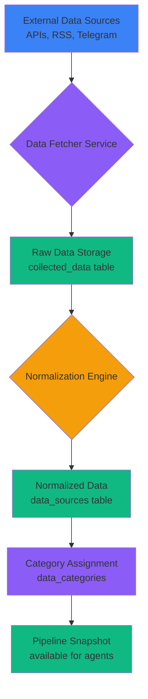
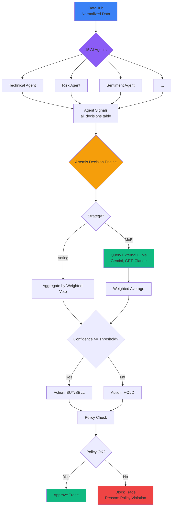
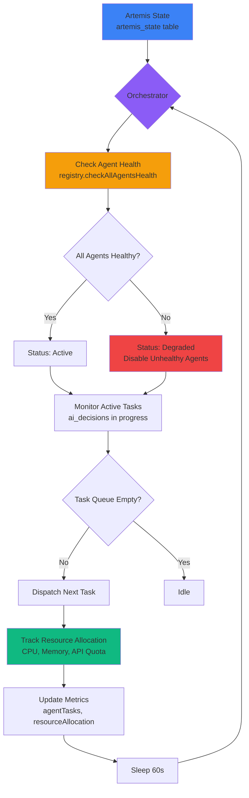

# **Titan AI Architecture – Single Source of Truth**

**Document Version**: 2.0  
**Date**: 2026-02-22  
**Scope**: AI Menu (Admin-only) – Dashboard → AI → AICenter  
**Status**: Comprehensive Specification for Developer Implementation

---

## **Executive Summary**

This document provides a **complete**, **formal**, and **developer-ready** specification of the Titan AI System architecture. It covers:

- **Full Menu Tree** with all levels, components, routes, and dependencies
- **Page Contracts** for every tab/page (Input, Output, Side Effects, Related Entities)
- **Formal Specs for 15 AI Agents** + **Artemis (Mother AI)**
- **5 Core Mermaid Workflows** (Ingestion, Dispatch, Intelligence, Artemis Control Loop, Distribution)
- **Entity Model** summary
- **Detailed Logging Architecture** (7 log categories)
- **"Nothing Missing" Checklist** with [UNKNOWN] markers for gaps

**Key Statistics**:
- **6 Main Menu Tabs** (Manager, Agents, Training, Analytics, Config, Topic Routing)
- **10 AIManager Sub-tabs** (Overview, Decision Engine, Orchestration, Learning, Monitoring, Scenarios, Data Hub, Backtesting, System Logs, Settings, Autopilot)
- **15 AI Agents** (Technical, Risk, Sentiment, Pattern, Price Prediction, Arbitrage, Portfolio, Liquidity, Trend, Optimization, Order, Fundamental, Market Intelligence, Volume, Timing)
- **Artemis (Mother AI)**: 3 Roles (Orchestrator, Decision Engine, Policy Controller)
- **15+ Database Tables** (ai_agents, ai_decisions, ai_learning_events, artemis_state, data_sources, telegram_messages, etc.)
- **9+ Backend API Routes** (`/api/ai-agents/*`, `/api/artemis/*`, `/api/data-sources/*`, `/api/telegram/*`, etc.)

---

## **1. Full Menu Tree**

### **1.1 Top-Level AI Menu Structure**

**Entry Point**: `Dashboard → AI → AICenter`  
**Component**: `components/AICenter.tsx`  
**Access**: Admin-only (`authenticate` middleware)

```typescript
AICenter
├── Tab: Manager (AIManager) ✅ Active
├── Tab: Agents (AIAgents)
├── Tab: Training (TrainingCenter)
├── Tab: Analytics (AnalyticsDashboard)
├── Tab: Config (APIConfig)
└── Tab: Topic Routing (TopicRouting)
```

**Default Tab**: `agents` (configured in `AICenter.tsx` line 27)

---

### **1.2 AIManager Sub-Tabs (The Core)**

**Component**: `components/ai/AIManager/index.tsx`  
**Sub-Components** (Lazy-loaded):

| **Tab Key** | **Display Name** | **Component File** | **Route** | **Purpose** | **Dependencies** | **Produces** | **Logs To** |
|---|---|---|---|---|---|---|---|
| `overview` | Overview | `OverviewTab.tsx` | `/ai?tab=manager&subtab=overview` | System health, agent summary, recent decisions | `GET /api/ai-agents/manager-overview` | UI stats (agents, decisions, health) | - |
| `decision_engine` | Decision Engine | `DecisionEngineTab.tsx` | `/ai?tab=manager&subtab=decision_engine` | Configure voting/MoE strategy, confidence thresholds | `GET /api/artemis/state`, `PATCH /api/artemis/config/decision-engine` | `artemis_state.config.decisionEngine` | `system_logs` (category: `artemis_decision`) |
| `orchestration` | Orchestration | `OrchestrationTab.tsx` | `/ai?tab=manager&subtab=orchestration` | Monitor agent tasks, resource allocation | `GET /api/artemis/orchestration` | `agentTasks[]`, `resourceAllocation{}` | - |
| `learning` | Learning | `LearningTab.tsx` | `/ai?tab=manager&subtab=learning` | View improvements, mistakes, learning rate | `GET /api/artemis/learning` | `improvements[]`, `mistakes[]`, `learningRate`, `adaptationSpeed` | `ai_learning_events` |
| `monitoring` | Monitoring | `MonitoringTab.tsx` | `/ai?tab=manager&subtab=monitoring` | Real-time agent status, alerts, performance charts | `GET /api/ai-agents/`, `WebSocket /ws` | Live agent metrics | - |
| `scenarios` | Scenarios | `ScenariosTab.tsx` | `/ai?tab=manager&subtab=scenarios` | Trading scenario backtesting | `GET /api/artemis/scenarios` | `trading_scenarios[]` | `system_logs` |
| `datahub` | Data Hub | `DataHubTab.tsx` | `/ai?tab=manager&subtab=datahub` | **7 sub-views** (see 1.3) | Multiple `/api/data-sources/*`, `/api/telegram/*` | Data pipeline stats | `data_hub_logs` |
| `backtesting` | Backtesting | `BacktestingTab.tsx` | `/ai?tab=manager&subtab=backtesting` | Historical agent performance analysis | `GET /api/backtest/*` | Backtest results, agent accuracy over time | `system_logs` |
| `logs` | System Logs | `SystemLogsTab.tsx` | `/ai?tab=manager&subtab=logs` | View all system logs (Artemis, agents, errors) | `GET /api/artemis/logs`, `GET /api/system-logs` | `system_logs[]`, `ai_decisions[]` | - |
| `settings` | Settings | `SettingsTab.tsx` | `/ai?tab=manager&subtab=settings` | Configure Artemis global settings, risk limits | `PUT /api/artemis/config` | `artemis_state.config` | `system_logs` |
| `autopilot` | Autopilot | `AutopilotTab.tsx` | `/ai?tab=manager&subtab=autopilot` | Enable/disable auto-trading, set rules | `GET /api/autopilot/status`, `POST /api/autopilot/toggle` | `autopilot_state`, `autopilot_rules` | `autopilot_logs` |

---

### **1.3 Data Hub Sub-Views (Inside AIManager → Data Hub)**

**Component**: `components/ai/AIManager/tabs/DataHubTab.tsx`

| **View Key** | **Display Name** | **Component File** | **Purpose** | **Dependencies** | **Produces** | **Logs To** |
|---|---|---|---|---|---|---|
| `sources` | Data Sources | `DataSourcesPanel.tsx` | Manage API/RSS/Telegram data sources | `GET /api/data-sources/` | `data_sources[]`, CRUD operations | `data_hub_logs` |
| `categories` | Categories | `CategoriesPanel.tsx` | Categorize data (e.g., News, Social, Technical) | `GET /api/data-categories/` | `data_categories[]`, CRUD | `data_hub_logs` |
| `pipeline` | Data Pipeline | `PipelinePanel.tsx` | View ingestion → normalization flow | `GET /api/data-sources/pipeline-snapshot` | `pipelineSnapshot`, `normalizationSummary` | `data_hub_logs` |
| `health` | Health Monitoring | *(Not implemented as separate panel, merged into overview)* | Check data source health | `GET /api/data-sources/health` | Health status per source | `data_hub_logs` |
| `logs` | Access Logs | `LogsPanel.tsx` | View data access logs | `GET /api/data-sources/logs` | `accessLogs[]`, log filters | `data_hub_logs` |
| `advanced` | Advanced Features | `AdvancedFeatures.tsx` | **8 sub-features** (see 1.4) | Multiple endpoints | Config for crawlers, blacklist, publisher | `data_hub_logs` |
| `telegram` | Telegram Collector | `TelegramPanel.tsx` + `TelegramDataPanel.tsx` | Manage Telegram accounts, channels, publish | `GET /api/telegram/*` | Telegram collector state, channels, messages | `telegram_processor_logs` |

---

### **1.4 Advanced Features (Inside Data Hub → Advanced)**

**Component**: `components/ai/AIManager/tabs/DataHub/AdvancedFeatures.tsx`

| **Feature Key** | **Display Name** | **Component** | **Purpose** | **API Endpoint** | **Produces** | **Logs To** |
|---|---|---|---|---|---|---|
| `web_crawlers` | Web Crawlers | `WebCrawlerConfig.tsx` | Configure web scraping jobs | `GET/POST /api/web-crawlers` | `web_crawler_configs[]` | `data_hub_logs` |
| `auto_discovery` | Auto Discovery | `AutoDiscoveryConfig.tsx` | Auto-detect new data sources | `GET/POST /api/auto-discovery` | `discovered_sources[]` | `data_hub_logs` |
| `smart_prioritization` | Smart Prioritization | `SmartPrioritization.tsx` | Rank data sources by quality/relevance | `GET/POST /api/smart-prioritization` | `source_quality_map{}` | `data_hub_logs` |
| `access_control` | Access Control | `AccessControlPanel.tsx` | Per-user access to data sources | `GET /api/access-control` | `access_rules[]` | `access_control_logs` |
| `blacklist_whitelist` | Blacklist/Whitelist | `BlacklistWhitelist.tsx` | Block/allow specific domains | `GET/POST /api/blacklist-whitelist` | `blacklist[]`, `whitelist[]` | `data_hub_logs` |
| `telegram_publisher` | Telegram Publisher | `TelegramPublisher.tsx` | Publish data to Telegram channels | `POST /api/data-sources/publish-telegram` | Telegram messages sent | `telegram_publish_logs` |
| `automation_topics` | Automation & Topics | `AutomationTopics.tsx` | Auto-route data to agents by topic | `GET/POST /api/topic-routing` | `topic_routing_rules[]` | `routing_logs` |
| `archiving` | Archiving | `Archiving.tsx` | Archive old data (backup/compression) | `POST /api/data-sources/archive` | Archive jobs | `data_hub_logs` |

---

## **2. Page Contracts (Input/Output/Side Effects)**

### **2.1 AIManager → Overview**

**Component**: `OverviewTab.tsx`  
**Route**: `/ai?tab=manager&subtab=overview`

| **Aspect** | **Details** |
|---|---|
| **Input Data** | None (auto-loaded on mount) |
| **API Call** | `GET /api/ai-agents/manager-overview` |
| **Output Data** | `{ artemis: {status, mode, strategy, overallAccuracy, totalDecisions, successfulDecisions}, agents: {total, active, idle, training, error, avgAccuracy, avgPerformance}, decisions: {total, successful, accuracy, recent24h, recent7d}, systemHealth: {cpu, memory, apiQuota} }` |
| **Side Effects** | Prefetch AI manager data on mount |
| **Related Entities** | `artemis_state`, `ai_agents`, `ai_decisions` |
| **Failure Points** | Database unavailable → returns empty stats; API timeout → shows error banner |
| **Visibility** | Admin-only |

---

### **2.2 AIManager → Decision Engine**

**Component**: `DecisionEngineTab.tsx`  
**Route**: `/ai?tab=manager&subtab=decision_engine`

| **Aspect** | **Details** |
|---|---|
| **Input Data** | User selection: `useMixture: boolean`, `models: string[]` (e.g., `["gemini-3", "gpt-5", "claude-4"]`) |
| **API Call** | `GET /api/artemis/state`, `PATCH /api/artemis/config/decision-engine` |
| **Output Data** | Updated `artemis_state.config.decisionEngine: {strategy, activeModel, confidenceThreshold, mixture: {enabled, models}}` |
| **Side Effects** | Updates global Artemis strategy; affects all future trading decisions |
| **Related Entities** | `artemis_state`, `ai_providers` (if MoE uses external LLMs) |
| **Failure Points** | Invalid model selection → validation error; database write failure → rollback transaction |
| **Visibility** | Admin-only |
| **Logs To** | `system_logs` (category: `artemis_decision`, level: `info`, message: `"Decision engine configuration updated"`) |

---

### **2.3 AIManager → Data Hub → Telegram**

**Component**: `TelegramPanel.tsx` + `TelegramDataPanel.tsx`  
**Route**: `/ai?tab=manager&subtab=datahub&view=telegram`

| **Aspect** | **Details** |
|---|---|
| **Input Data** | Phone number, auth code (for login); channel ID (for test/link); category selection |
| **API Calls** | `POST /api/telegram/collector/login`, `POST /api/telegram/collector/confirm-login`, `GET /api/telegram/collector/channels`, `POST /api/data-sources/telegram-sync`, `POST /api/data-sources/telegram-transfer-messages` |
| **Output Data** | `telegram_accounts[]`, `telegram_channels[]`, `telegram_messages[]`, collector health status |
| **Side Effects** | Creates new Telegram session; links channels to `data_sources`; transfers messages to `collected_data` |
| **Related Entities** | `telegram_accounts`, `telegram_channels`, `telegram_messages`, `data_sources`, `collected_data` |
| **Failure Points** | Auth timeout (60s) → session expired; invalid phone → Telegram API error; channel test failure → network issue |
| **Visibility** | Admin-only |
| **Logs To** | `telegram_collector_logs` (collector service), `data_hub_logs` (sync operations), `telegram_processor_logs` (message processing) |

---

### **2.4 AIManager → Autopilot**

**Component**: `AutopilotTab.tsx`  
**Route**: `/ai?tab=manager&subtab=autopilot`

| **Aspect** | **Details** |
|---|---|
| **Input Data** | `enabled: boolean`, `rules: {maxDailyTrades, maxConcurrentTrades, riskPerTrade, stopLossPercent, takeProfitPercent}` |
| **API Calls** | `GET /api/autopilot/status`, `POST /api/autopilot/toggle`, `PUT /api/autopilot/rules` |
| **Output Data** | `autopilot_state: {enabled, activeTrades, totalTrades24h, pnl24h, lastDecision}`, `autopilot_rules` |
| **Side Effects** | Enables/disables auto-trading; updates risk limits; triggers real trades if in **Real Mode** |
| **Related Entities** | `autopilot_state`, `autopilot_rules`, `autopilot_logs`, `manual_trades` (if autopilot executes) |
| **Failure Points** | Autopilot disabled by Artemis if daily loss limit hit; API call to exchange fails → log error, skip trade |
| **Visibility** | Admin-only |
| **Logs To** | `autopilot_logs` (category: `autopilot_decision`, level: `info/warning/error`, message: trade actions) |

---

### **2.5 Agents Page (AIAgents)**

**Component**: `components/ai/AIAgents.tsx` *(Not part of AIManager, but accessible via top-level tab)*  
**Route**: `/ai?tab=agents`

| **Aspect** | **Details** |
|---|---|
| **Input Data** | User selects agent, inputs symbol/timeframe, clicks "Run Analysis" |
| **API Calls** | `GET /api/ai-agents/`, `POST /api/ai-agents/:id/run`, `POST /api/ai-agents/:id/command`, `PATCH /api/ai-agents/:id/config` |
| **Output Data** | Agent list with status, accuracy, decisions; analysis result `{signal, confidence, indicators[]}` |
| **Side Effects** | Creates `ai_decisions` record; updates `ai_agents.last_active_at`; triggers webhooks (if configured); sends WebSocket notification |
| **Related Entities** | `ai_agents`, `ai_decisions`, `ai_agent_version_history` (if version tracking enabled) |
| **Failure Points** | Agent timeout (30s default) → status 504; agent disabled → status 403; invalid input → status 400 |
| **Visibility** | Admin-only |
| **Logs To** | `ai_decisions` (logged automatically via `logAndReturn` helper), `system_logs` (agent errors) |

---

## **3. Formal Specs for 15 AI Agents**

### **3.1 Agent Registry Overview**

**Backend Component**: `backend/services/agents/registry.js`  
**Purpose**: Central dispatcher for all 15 AI agents  
**Agent Module Format**: Each agent must implement:
- `run(params)`: Execute agent logic
- `getDetails(params)`: Return agent metadata
- `defaultConfig()`: Return default configuration
- *(Optional)* `command({command, payload})`: Handle control commands
- *(Optional)* `healthCheck()`: Return health status
- *(Optional)* `validateConfig(config)`: Validate configuration

**Agent Keys** (from `backend/services/agents/registry.js`):
```javascript
const AGENT_MODULES = {
  'technical': './technical.js',
  'risk': './risk.js',
  'sentiment': './sentiment.js',
  'pattern': './pattern.js',
  'price_prediction': './price_prediction.js',
  'arbitrage': './arbitrage.js',
  'portfolio': './portfolio.js',
  'liquidity': './liquidity.js',
  'trend': './trend.js',
  'optimization': './optimization.js',
  'order': './order.js',
  'fundamental': './fundamental.js',
  'market_intelligence': './market_intelligence.js',
  'volume': './volume.js',
  'timing': './timing.js'
};
```

---

### **3.2 Agent Specification Template**

For each agent, the following contract is enforced:

| **Field** | **Description** |
|---|---|
| **Agent Key** | Unique identifier (e.g., `technical`, `risk`) |
| **Trigger** | Manual (user-initiated), Scheduled (cron), Event-driven (webhook/websocket) |
| **Input Schema** | `{ userId?, agent_id, symbol, timeframe?, config?, input? }` |
| **Context Sources** | Market data APIs (Binance, CoinGecko), Historical DB, User portfolio, External signals |
| **Output Schema** | `{ timestamp, symbol, timeframe?, signal: "BUY"|"SELL"|"HOLD", confidence: 0-100, indicators: [], reasoning?, _meta: {source, version, cached?} }` |
| **Storage** | `ai_decisions` table (agent_id, input_data, output_data, confidence, was_successful, execution_time_ms, created_at, agent_version) |
| **Consumption** | Artemis Decision Engine (aggregates signals), Trading Engine (executes trades), UI (displays results) |
| **UI Visibility** | Agent card in AIAgents page, control panel in agent detail view, indicators chart |

---

### **3.3 Agent-Specific Specs**

#### **3.3.1 Technical Analysis Agent**

| **Field** | **Value** |
|---|---|
| **Agent Key** | `technical` |
| **Trigger** | Manual (user clicks "Run Analysis"), Scheduled (every 5min for autopilot) |
| **Input** | `{ symbol, timeframe }` |
| **Context** | Binance OHLCV API, technical indicators library (RSI, MACD, Bollinger Bands) |
| **Output** | `{ signal, confidence, indicators: [{indicatorId: "RSI", value: 54, signal: "buy", weight: 50}, ...], priceTarget?, _meta }` |
| **Storage** | `ai_decisions` (decision_type: `technical_analysis`) |
| **Consumption** | Artemis aggregates with other agents; UI displays indicators as colored badges |
| **UI Component** | `TechnicalAnalysisControlPanel.tsx` (lazy-loaded from `agentRegistry.ts`) |
| **Fallback** | If API timeout → return `{signal: "NEUTRAL", confidence: 55, indicators: {rsi: 50, macd: 0, trend: "sideways"}, _meta: {isFallback: true}}` |

---

#### **3.3.2 Risk Management Agent**

| **Field** | **Value** |
|---|---|
| **Agent Key** | `risk` |
| **Trigger** | Manual, Before every trade (pre-execution check) |
| **Input** | `{ symbol, action: "BUY"|"SELL"|"ASSESS", amount, price? }` |
| **Context** | User portfolio, position size limits, daily loss tracking, volatility data |
| **Output** | `{ recommendation: "APPROVE"|"REJECT"|"ADJUST"|"HOLD", confidence, riskLevel: "low"|"medium"|"high"|"extreme", reasoning, _meta }` |
| **Storage** | `ai_decisions` (decision_type: `risk_assessment`) |
| **Consumption** | Artemis Decision Engine (blocks trades if risk too high), Autopilot (adjusts position size) |
| **UI Component** | `RiskControlPanel.tsx` |
| **Fallback** | If error → `{recommendation: "HOLD", confidence: 50, riskLevel: "medium", _meta: {isFallback: true}}` |

---

#### **3.3.3 Sentiment Analysis Agent**

| **Field** | **Value** |
|---|---|
| **Agent Key** | `sentiment` |
| **Trigger** | Scheduled (every 15min), Event-driven (new social media data) |
| **Input** | `{ symbol, timeframe? }` |
| **Context** | Twitter API, Telegram channels, Reddit scraper, news sentiment |
| **Output** | `{ signal, confidence, sentiment: "bullish"|"bearish"|"neutral", sentimentScore: -100 to 100, sources: [{source: "Twitter", score: 0.7, volume: 1250}, ...], _meta }` |
| **Storage** | `ai_decisions` (decision_type: `sentiment_analysis`) |
| **Consumption** | Artemis (boosts confidence if sentiment aligns with technical), UI (sentiment chart) |
| **UI Component** | `SentimentControlPanel.tsx` |
| **Fallback** | If no data → `{signal: "NEUTRAL", confidence: 50, sentiment: "neutral", sentimentScore: 0, sources: [], _meta: {isFallback: true}}` |

---

#### **3.3.4 Pattern Recognition Agent**

| **Field** | **Value** |
|---|---|
| **Agent Key** | `pattern` |
| **Trigger** | Scheduled (every 1h), Manual |
| **Input** | `{ symbol, timeframe }` |
| **Context** | Historical price data, pattern library (head & shoulders, double top, etc.) |
| **Output** | `{ signal, confidence, patterns: [{name: "Head and Shoulders", confidence: 0.85, type: "reversal"}, ...], _meta }` |
| **Storage** | `ai_decisions` (decision_type: `pattern_recognition`) |
| **Consumption** | Artemis (high-confidence patterns boost signal), UI (pattern overlay on chart) |
| **UI Component** | `PatternControlPanel.tsx` |
| **Fallback** | If no patterns detected → `{signal: "NEUTRAL", confidence: 50, patterns: [], _meta: {isFallback: true}}` |

---

#### **3.3.5 Price Prediction Agent**

| **Field** | **Value** |
|---|---|
| **Agent Key** | `price_prediction` |
| **Trigger** | Scheduled (every 6h), Manual |
| **Input** | `{ symbol, timeframe }` |
| **Context** | ML model (LSTM/Transformer), historical price data |
| **Output** | `{ signal, confidence, predictedPrice: 42500, priceRange: {low: 41000, high: 44000}, timeHorizon: "24h", _meta }` |
| **Storage** | `ai_decisions` (decision_type: `price_prediction`) |
| **Consumption** | Artemis (compares with current price for signal), UI (price prediction chart) |
| **UI Component** | `PricePredictionControlPanel.tsx` |
| **Fallback** | If ML model unavailable → `{signal: "NEUTRAL", confidence: 50, predictedPrice: currentPrice, _meta: {isFallback: true}}` |

---

#### **3.3.6 Arbitrage Agent**

| **Field** | **Value** |
|---|---|
| **Agent Key** | `arbitrage` |
| **Trigger** | Scheduled (every 10s for hot pairs), Manual |
| **Input** | `{ symbols?: [...], config?: {minProfitBps, maxSlippageBps, exchanges} }` |
| **Context** | Multi-exchange price feeds (Binance, Coinbase, Kraken, Huobi), order book depth |
| **Output** | `{ timestamp, summary: {totalOpportunities, totalProfitUSDT}, opportunities: [{pairSymbol, buyExchange, sellExchange, profitBps, volume, executionTime}, ...], riskAlerts: [], config, _meta }` |
| **Storage** | `ai_decisions` (decision_type: `arbitrage_scan`) |
| **Consumption** | Autopilot (executes if profitBps > threshold), UI (opportunity table) |
| **UI Component** | `ArbitrageControlPanel.tsx` |
| **Fallback** | If exchange API down → `{summary: {totalOpportunities: 0}, opportunities: [], riskAlerts: [{level: "high", message: "Exchange API unavailable"}], _meta: {isFallback: true}}` |

---

#### **3.3.7 Portfolio Allocation Agent**

| **Field** | **Value** |
|---|---|
| **Agent Key** | `portfolio` |
| **Trigger** | Scheduled (daily rebalance), Manual |
| **Input** | `{ userId, config?: {targetAllocation: {"BTC": 40, "ETH": 30, "USDT": 30}, rebalanceThreshold: 5} }` |
| **Context** | User portfolio (current holdings), market prices, risk profile |
| **Output** | `{ signal, confidence, currentAllocation: {...}, targetAllocation: {...}, rebalanceActions: [{symbol, action: "BUY"|"SELL", amount}, ...], _meta }` |
| **Storage** | `ai_decisions` (decision_type: `portfolio_allocation`) |
| **Consumption** | Autopilot (executes rebalance trades), UI (allocation pie chart) |
| **UI Component** | `PortfolioControlPanel.tsx` |
| **Fallback** | If portfolio data unavailable → `{signal: "HOLD", confidence: 0, rebalanceActions: [], _meta: {isFallback: true}}` |

---

#### **3.3.8 Liquidity Analysis Agent**

| **Field** | **Value** |
|---|---|
| **Agent Key** | `liquidity` |
| **Trigger** | Scheduled (every 1h), Before large trades |
| **Input** | `{ symbol, orderSize? }` |
| **Context** | Order book depth, recent trade volume, slippage calculator |
| **Output** | `{ signal, confidence, liquidityScore: 0-100, avgLiquidityScore, avgSpread, avgSlippage50k, riskLevel: "low"|"medium"|"high", alertsTriggered: 0, _meta }` |
| **Storage** | `ai_decisions` (decision_type: `liquidity_analysis`) |
| **Consumption** | Risk Agent (blocks trades if liquidity too low), UI (liquidity gauge) |
| **UI Component** | `LiquidityControlPanel.tsx` |
| **Fallback** | If order book unavailable → `{liquidityScore: 50, riskLevel: "medium", alertsTriggered: 0, _meta: {isFallback: true}}` |

---

#### **3.3.9 Trend Detection Agent**

| **Field** | **Value** |
|---|---|
| **Agent Key** | `trend` |
| **Trigger** | Scheduled (every 30min), Manual |
| **Input** | `{ symbol, timeframe }` |
| **Context** | Moving averages (EMA, SMA), price history |
| **Output** | `{ signal, confidence, trend: "uptrend"|"downtrend"|"sideways", trendStrength: 0-100, trendDuration: "1d", _meta }` |
| **Storage** | `ai_decisions` (decision_type: `trend_analysis`) |
| **Consumption** | Technical Agent (cross-validates signals), UI (trend arrow) |
| **UI Component** | `TrendControlPanel.tsx` |
| **Fallback** | If data insufficient → `{signal: "NEUTRAL", trend: "sideways", trendStrength: 0, _meta: {isFallback: true}}` |

---

#### **3.3.10 Optimization Agent**

| **Field** | **Value** |
|---|---|
| **Agent Key** | `optimization` |
| **Trigger** | Manual (user runs optimizer), Scheduled (weekly parameter tuning) |
| **Input** | `{ agentKey: "technical"|"risk"|..., parameters?: {...} }` |
| **Context** | Historical backtest data, grid search/genetic algorithm |
| **Output** | `{ signal, confidence, optimizedParams: {...}, expectedAccuracy: 0.85, backtestResults: {...}, _meta }` |
| **Storage** | `ai_decisions` (decision_type: `optimization`) |
| **Consumption** | Auto-updates agent config if user approves; UI (parameter comparison table) |
| **UI Component** | `OptimizationControlPanel.tsx` |
| **Fallback** | If backtest data missing → `{signal: "HOLD", optimizedParams: null, _meta: {isFallback: true}}` |

---

#### **3.3.11 Order Management Agent**

| **Field** | **Value** |
|---|---|
| **Agent Key** | `order` |
| **Trigger** | Event-driven (new signal from Artemis), Manual (user places order) |
| **Input** | `{ symbol, side: "BUY"|"SELL", amount, orderType: "MARKET"|"LIMIT", price?, stopLoss?, takeProfit? }` |
| **Context** | Exchange API, order book, execution history |
| **Output** | `{ signal, confidence, orderId, status: "PLACED"|"FILLED"|"CANCELLED", executionPrice, slippage, _meta }` |
| **Storage** | `ai_decisions` (decision_type: `order_management`), `manual_trades` (if executed) |
| **Consumption** | Trading Engine (tracks order status), UI (order history table) |
| **UI Component** | `OrderControlPanel.tsx` |
| **Fallback** | If exchange API fails → `{signal: "HOLD", status: "FAILED", _meta: {isFallback: true, error: "Exchange API unavailable"}}` |

---

#### **3.3.12 Fundamental Analysis Agent**

| **Field** | **Value** |
|---|---|
| **Agent Key** | `fundamental` |
| **Trigger** | Scheduled (daily), Manual |
| **Input** | `{ symbol }` |
| **Context** | Fear & Greed Index, funding rate, on-chain data (active addresses, etc.), news sentiment |
| **Output** | `{ timestamp, symbol, decision: "buy"|"sell"|"hold", confidence, averageScore, marketSummary: {fearGreed, macroLabel, fundingImbalance}, alerts: [], score: {total, macro, funding, onchain, news}, overview, company_project_data, financial_ratios, events_news, onchain_tokenomics, fair_value, signals: [], raw: {executionTime}, _meta }` |
| **Storage** | `ai_decisions` (decision_type: `fundamental_analysis`) |
| **Consumption** | Artemis (long-term bias), UI (fundamental score breakdown) |
| **UI Component** | `FundamentalControlPanel.tsx` |
| **Fallback** | If external APIs fail → `{decision: "hold", confidence: 50, score: {total: 0}, _meta: {isFallback: true}}` |

---

#### **3.3.13 Market Intelligence Agent**

| **Field** | **Value** |
|---|---|
| **Agent Key** | `market_intelligence` |
| **Trigger** | Scheduled (every 1h), Manual |
| **Input** | `{ symbol?, topic? }` |
| **Context** | News aggregator, regulatory announcements, whale wallet tracking |
| **Output** | `{ signal, confidence, intelligence: [{topic, summary, impact: "bullish"|"bearish"|"neutral", sources: [...]}], _meta }` |
| **Storage** | `ai_decisions` (decision_type: `market_intelligence`) |
| **Consumption** | Artemis (adjusts confidence based on major news), UI (intelligence feed) |
| **UI Component** | `MarketIntelligenceControlPanel.tsx` |
| **Fallback** | If no new intelligence → `{signal: "NEUTRAL", confidence: 50, intelligence: [], _meta: {isFallback: true}}` |

---

#### **3.3.14 Volume Analysis Agent**

| **Field** | **Value** |
|---|---|
| **Agent Key** | `volume` |
| **Trigger** | Scheduled (every 15min), Manual |
| **Input** | `{ symbol, timeframe }` |
| **Context** | Recent trade volume, volume profile, unusual volume spikes |
| **Output** | `{ signal, confidence, volume: {current, average, change: "+25%"}, volumeProfile: {buyVolume, sellVolume}, anomalies: [], _meta }` |
| **Storage** | `ai_decisions` (decision_type: `volume_analysis`) |
| **Consumption** | Pattern Agent (confirms breakouts), UI (volume histogram) |
| **UI Component** | `VolumeControlPanel.tsx` |
| **Fallback** | If volume data missing → `{signal: "NEUTRAL", confidence: 50, volume: {current: 0, average: 0, change: "0%"}, _meta: {isFallback: true}}` |

---

#### **3.3.15 Timing Analysis Agent**

| **Field** | **Value** |
|---|---|
| **Agent Key** | `timing` |
| **Trigger** | Scheduled (every 5min for autopilot), Manual |
| **Input** | `{ symbol }` |
| **Context** | Recent volatility, session time (Asian/European/US), liquidity windows |
| **Output** | `{ signal: "ENTER"|"WAIT"|"EXIT", confidence, timing: "immediate"|"soon"|"later", optimalTimeWindow: "15:00-16:00 UTC", reasoning, _meta }` |
| **Storage** | `ai_decisions` (decision_type: `timing_analysis`) |
| **Consumption** | Autopilot (delays trades if timing is "later"), UI (timing recommendation badge) |
| **UI Component** | `TimingControlPanel.tsx` |
| **Fallback** | If timing data unavailable → `{signal: "WAIT", confidence: 55, timing: "neutral", _meta: {isFallback: true}}` |

---

## **4. Artemis (Mother AI) Specification**

### **4.1 Overview**

**Artemis** is the **orchestration layer** that:
1. **Aggregates** signals from 15 AI agents
2. **Makes final trading decisions** using configurable strategies (Voting, Mixture-of-Experts)
3. **Enforces global policies** (risk limits, daily loss caps, max concurrent trades)

**Database Table**: `artemis_state`  
**Backend Routes**: `/api/artemis/*` (file: `backend/routes/artemis.js`)

---

### **4.2 Artemis Roles**

#### **4.2.1 Role 1: Orchestrator**

**Purpose**: Assign tasks to agents, monitor execution, manage resource allocation

**Responsibilities**:
- Load and initialize 15 agents from registry (`backend/services/agents/registry.js`)
- Dispatch analysis requests to agents (manual or scheduled)
- Track agent health status (healthy/degraded/unhealthy)
- Collect agent execution metrics (response time, success rate, cache hits)
- Balance load across agents (e.g., if Technical Agent is overloaded, queue requests)

**Data Sources**:
- `ai_agents` table (agent status, is_enabled, last_active_at)
- `ai_decisions` table (execution_time_ms, was_successful)
- Agent Registry health checks (`checkAllAgentsHealth()` from `registry.js`)

**Output**:
- `GET /api/artemis/orchestration` → `{ activeAgents, agentTasks: [{id, agentId, type, status, priority, startedAt, completedAt, executionTimeMs}], resourceAllocation: {[agent_id]: {cpu, memory, apiQuota, taskCount, avgExecutionTimeMs}} }`

**UI Visibility**: AIManager → Orchestration tab (`OrchestrationTab.tsx`)

---

#### **4.2.2 Role 2: Decision Engine**

**Purpose**: Aggregate agent signals and make final trading decision (BUY/SELL/HOLD)

**Strategies** (configured in `artemis_state.config.decisionEngine`):

1. **Voting** (default):
   - Each agent casts a vote (BUY/SELL/HOLD) weighted by its `performance_score`
   - Final decision = majority vote
   - Example: If 8 agents say BUY, 3 say SELL, 4 say HOLD → Decision: BUY

2. **Mixture-of-Experts (MoE)**:
   - Query multiple external LLMs (Gemini 3, GPT-5, Claude 4) via `artemisOrchestrator.js`
   - Each LLM receives: `{opportunity, signals: [...], context: {activeTrades, portfolioValue, dailyLoss}}`
   - Aggregate LLM responses using weighted average of confidence scores
   - Example: Gemini (confidence: 85%, action: BUY, weight: 0.4) + GPT (confidence: 80%, action: BUY, weight: 0.3) + Claude (confidence: 75%, action: HOLD, weight: 0.3) → Final: BUY (confidence: 81%)

3. **Confidence Threshold Filter**:
   - Only approve trades if final confidence ≥ threshold (default: 75%)
   - If confidence < threshold → action = HOLD

**Data Sources**:
- `ai_agents` (performance_score, accuracy)
- `ai_decisions` (recent signals from all agents)
- `artemis_state.config.decisionEngine` (strategy, activeModel, confidenceThreshold, mixture.models)

**Output**:
- `POST /api/artemis/decision` (body: `{opportunity, signals, context}`) → `{ action: "BUY"|"SELL"|"HOLD", approved: boolean, reason, confidence, signals: count, providers?: [{provider, confidence, action}] }`

**UI Visibility**: AIManager → Decision Engine tab (`DecisionEngineTab.tsx`)

**Logs To**: `system_logs` (category: `artemis_decision`, level: `info`, metadata: `{opportunity, context, signals, strategy, activeModel, mixture?, decision}`)

---

#### **4.2.3 Role 3: Policy Controller**

**Purpose**: Enforce global trading rules and risk limits

**Policies Enforced**:
1. **Max Concurrent Trades**: Block new trades if `context.activeTrades >= context.maxTrades`
2. **Daily Loss Limit**: Block trades if `|context.dailyLoss| > (context.portfolioValue * 0.05)` (5% loss cap)
3. **Agent Availability**: Only use signals from agents where `is_enabled = true` and `status = 'active'`
4. **Artemis Status Check**: Block all decisions if `artemis_state.status != 'active'`

**Data Sources**:
- `artemis_state` (status, mode, config)
- `user_preferences` (trading.mode: "demo"|"real")
- Trading Engine context (`{ activeTrades, portfolioValue, dailyLoss, maxTrades }`)

**Output**:
- `POST /api/artemis/decision` → If policy violation: `{ action: "HOLD", approved: false, reason: "Policy violation: Daily loss limit reached", confidence: 0 }`

**UI Visibility**: AIManager → Settings tab (configure risk limits)

**Logs To**: `system_logs` (category: `artemis_decision`, level: `warning`, message: `"Artemis decision blocked: {reason}"`)

---

### **4.3 Artemis Configuration**

**Storage**: `artemis_state.config` (JSONB column)

**Schema**:
```json
{
  "decisionEngine": {
    "strategy": "mixture_of_experts" | "voting",
    "activeModel": "hybrid" | "internal",
    "confidenceThreshold": 75,
    "mixture": {
      "enabled": true,
      "models": [
        { "provider": "gemini-3", "model": "gemini-3-ultra", "weight": 0.4, "enabled": true },
        { "provider": "gpt-5", "model": "gpt-5-turbo", "weight": 0.3, "enabled": true },
        { "provider": "claude-4", "model": "claude-4-opus", "weight": 0.3, "enabled": true }
      ]
    }
  },
  "policies": {
    "maxConcurrentTrades": 5,
    "dailyLossLimitPercent": 5,
    "minAgentConfidence": 60
  }
}
```

**API Endpoints**:
- `GET /api/artemis/state` → Get full Artemis state (status, mode, strategy, config)
- `PATCH /api/artemis/state` → Update status/mode/strategy
- `PATCH /api/artemis/config/decision-engine` → Update MoE config
- `PUT /api/artemis/config` → Deep merge global config

---

## **5. Mermaid Workflows**

### **5.1 Ingestion Flow (Data Sources → DataHub)**



**Trigger**: Scheduled (via `dataFetcherService.js` cron), Manual (via "Refresh" button in DataHub)  
**Logs To**: `data_hub_logs` (source_id, level, message, metadata)

---

### **5.2 Dispatch Flow (User Request → Agent Execution)**

```mermaid
flowchart TD
    A[User clicks<br/>Run Analysis] --> B{AIAgents UI}
    B --> C[POST /api/ai-agents/:id/run]
    C --> D{Agent Registry<br/>registry.js}
    D --> E{Load Agent Module<br/>technical.js, risk.js, etc.}
    E --> F{Execute agent.run}
    F --> G[Return Result<br/>{signal, confidence, indicators}]
    G --> H[Log to ai_decisions table]
    H --> I[Update agent.last_active_at]
    I --> J[Send WebSocket Notification]
    J --> K[Return JSON to UI]
    
    style A fill:#3b82f6
    style D fill:#8b5cf6
    style E fill:#f59e0b
    style F fill:#10b981
    style H fill:#ef4444
    style J fill:#8b5cf6
```

**Error Handling**:
- Timeout (30s) → status 504, log to `system_logs`
- Agent disabled → status 403
- Validation error → status 400

---

### **5.3 Intelligence Flow (Data → Agents → Artemis → Decision)**



**Logs To**: `system_logs` (category: `artemis_decision`), `ai_decisions`

---

### **5.4 Artemis Control Loop (Orchestration + Monitoring)**



**Trigger**: Periodic health check (every 60s via `startPeriodicHealthChecks()` in `registry.js`)  
**UI Visibility**: AIManager → Monitoring tab (real-time agent status), Orchestration tab (task queue)

---

### **5.5 Distribution Flow (Decision → Execution → Feedback)**

```mermaid
flowchart TD
    A[Artemis Decision<br/>{action, approved, confidence}] --> B{Trading Engine}
    B --> C{Mode?}
    C -->|Demo| D[Simulated Execution<br/>Update virtual portfolio]
    C -->|Real| E[Exchange API Call<br/>Place Order]
    E --> F{Order Status?}
    F -->|Filled| G[Update Portfolio]
    F -->|Cancelled/Failed| H[Log Error]
    D --> I[Store Result<br/>manual_trades table]
    G --> I
    H --> I
    I --> J[WebSocket Notification<br/>to UI]
    J --> K[Update Agent Metrics<br/>was_successful flag]
    K --> L[Learning System<br/>ai_learning_events]
    L --> M{Performance Review}
    M --> N[Update Agent Accuracy<br/>ai_agents.accuracy]
    
    style A fill:#3b82f6
    style B fill:#8b5cf6
    style E fill:#f59e0b
    style G fill:#10b981
    style H fill:#ef4444
    style L fill:#8b5cf6
```

**Logs To**: `autopilot_logs` (if autopilot enabled), `manual_trades` (all executions), `ai_learning_events` (if trade result is known)

---

## **6. Entity Model Summary**

### **6.1 Core Tables**

| **Table** | **Purpose** | **Key Fields** | **Relationships** |
|---|---|---|---|
| `ai_agents` | Stores 15 agent configurations | id, agent_key, name, type, status, config, metadata, accuracy, performance_score, total_decisions, successful_decisions, is_enabled, version, version_updated_at, created_at, updated_at, last_active_at | → `ai_decisions.agent_id`, → `ai_learning_events.agent_id` |
| `ai_decisions` | Logs every agent execution | id, agent_id, user_id, decision_type, input_data, output_data, confidence, was_successful, execution_time_ms, created_at, metadata, agent_version | ← `ai_agents.id`, ← `users.id` |
| `ai_learning_events` | Tracks improvements & mistakes | id, event_type, decision_id, agent_id, area, method, impact, correction, learned, source, metadata, created_at | ← `ai_decisions.id`, ← `ai_agents.id` |
| `artemis_state` | Stores Artemis global state | id, status, mode, strategy, config (JSONB), overall_accuracy, total_decisions, successful_decisions, created_at, updated_at | - |
| `data_sources` | DataHub external sources | id, name, type, url, category, refresh_interval, next_fetch_at, config, credentials (encrypted), is_active, last_fetch_at, created_at, updated_at, created_by, updated_by | → `data_hub_logs.source_id`, → `collected_data.source_id` |
| `collected_data` | Raw data from sources | id, source_id, raw_data, normalized_data, collected_at, processed_at, status, error_message, metadata, created_at | ← `data_sources.id` |
| `data_categories` | Categorize data sources | id, name, description, color, icon, created_at, updated_at, created_by | - |
| `data_hub_logs` | DataHub access logs | id, source_id, level, message, metadata, created_at | ← `data_sources.id` |
| `telegram_accounts` | Telegram collector accounts | id, phone_number, session_id, is_active, created_at, updated_at | → `telegram_channels.account_id` |
| `telegram_channels` | Telegram channels tracked | id, account_id, channel_id, username, title, category, is_active, last_synced, created_at, updated_at | ← `telegram_accounts.id`, → `telegram_messages.channel_id` |
| `telegram_messages` | Collected Telegram messages | id, channel_id, message_id, text, media, views, forwards, author, posted_at, collected_at, created_at | ← `telegram_channels.id` |
| `telegram_agent_impact` | Agent scores from Telegram | id, message_id, agent_key, impact_score, confidence, reasoning, created_at | ← `telegram_messages.id` |
| `autopilot_state` | Autopilot runtime state | id, enabled, active_trades, total_trades_24h, pnl_24h, last_decision, created_at, updated_at | - |
| `autopilot_rules` | Autopilot risk rules | id, max_daily_trades, max_concurrent_trades, risk_per_trade, stop_loss_percent, take_profit_percent, created_at, updated_at | - |
| `autopilot_logs` | Autopilot decision logs | id, level, category, message, metadata, created_at | - |
| `system_logs` | Global system logs | id, level, category, message, metadata, created_at | - |
| `manual_trades` | Trade execution records | id, user_id, symbol, side, amount, price, status, order_id, executed_at, created_at | ← `users.id` |
| `user_preferences` | Per-user settings | id, user_id, preferences (JSONB: {trading: {mode: "demo"|"real"}}), created_at, updated_at | ← `users.id` |
| `ai_agent_version_history` | Agent version tracking | id, agent_key, version, previous_version, change_type, change_description, changed_by, created_at, metadata | - |
| `trading_scenarios` | Backtest scenarios | id, name, description, config, results, created_at, updated_at | - |

---

### **6.2 Additional Entities (If Applicable)**

| **Entity** | **Purpose** | **Status** |
|---|---|---|
| `ai_providers` | External LLM provider credentials (for MoE) | [UNKNOWN – Need to check if table exists] |
| `webhooks` | Webhook subscriptions for agent events | [UNKNOWN – Check `backend/services/webhookDispatcher.js`] |
| `web_crawler_configs` | Web scraper job configs (DataHub Advanced) | [UNKNOWN – Check if implemented] |
| `topic_routing_rules` | Auto-route data to agents by topic | [UNKNOWN – Check `backend/routes/topic-routing.js`] |
| `access_control` | Per-user data source access rules | [UNKNOWN – Check `backend/routes/access-control.js`] |

---

## **7. Detailed Logging Architecture**

### **7.1 Log Categories**

| **Category** | **Table** | **Purpose** | **Logged By** | **Example Message** |
|---|---|---|---|---|
| **1. Access Logs** | `data_hub_logs` | Track DataHub API calls, source CRUD | `POST /api/data-sources/` | `"Source created: Telegram Channel XYZ"` |
| **2. Routing Logs** | `system_logs` (category: `routing`) | Track topic routing decisions | `AutomationTopics.tsx` → `POST /api/topic-routing` | `"Data routed to agent: sentiment (topic: crypto_news)"` |
| **3. Agent Execution Logs** | `ai_decisions` + `system_logs` | Log every agent run (input, output, time, success) | `POST /api/ai-agents/:id/run` | `"Agent technical completed in 1250ms (confidence: 85%)"` |
| **4. Decision Logs** | `system_logs` (category: `artemis_decision`) | Artemis final decisions (BUY/SELL/HOLD) | `POST /api/artemis/decision` | `"Artemis decision: BUY (confidence: 81%, strategy: MoE, providers: 3)"` |
| **5. Autopilot Logs** | `autopilot_logs` | Autopilot trade executions, rule checks | `POST /api/autopilot/toggle` | `"Autopilot blocked trade: max concurrent trades reached (5/5)"` |
| **6. Telegram Publish Logs** | `system_logs` (category: `telegram_publish`) | Track Telegram message publishing | `POST /api/data-sources/publish-telegram` | `"Published to Telegram: Channel @crypto_signals (messageId: 12345)"` |
| **7. System Logs** | `system_logs` (catch-all) | Errors, warnings, info events | All services | `"Agent risk timeout after 30s (agent_id: abc-123)"` |

---

### **7.2 Log Retention & Access**

| **Log Type** | **Retention Period** | **UI Access** | **API Endpoint** |
|---|---|---|---|
| `ai_decisions` | 90 days (configurable) | AIManager → System Logs tab | `GET /api/artemis/logs` (limit/offset pagination) |
| `data_hub_logs` | 30 days | DataHub → Logs tab | `GET /api/data-sources/logs` (filterable by source_id, level) |
| `autopilot_logs` | 60 days | Autopilot tab (logs panel) | `GET /api/autopilot/logs` |
| `system_logs` | 30 days (60 for errors) | AIManager → System Logs tab | `GET /api/system-logs` (filterable by category, level) |
| `ai_learning_events` | Permanent (for ML training) | AIManager → Learning tab | `GET /api/artemis/learning` |

**Cleanup API**:
- `DELETE /api/artemis/logs?days=30` (clears logs older than N days)
- `DELETE /api/data-sources/logs?days=30`

---

### **7.3 Log Levels**

| **Level** | **Use Case** | **Example** |
|---|---|---|
| `debug` | Development/troubleshooting | `"Agent config normalized: {rsi_period: 14, macd: {fast: 12, slow: 26}}"` |
| `info` | Normal operation | `"Agent technical started (symbol: BTCUSDT, timeframe: 1h)"` |
| `warning` | Non-critical issues | `"Agent sentiment: No Twitter data available, using Reddit only"` |
| `error` | Failures requiring attention | `"Agent arbitrage timeout after 30s (exchange API down)"` |

---

## **8. "Nothing Missing" Checklist**

### **8.1 Menu Completeness**

| **Item** | **Status** | **Notes** |
|---|---|---|
| AICenter top-level tabs (6) | ✅ Complete | Manager, Agents, Training, Analytics, Config, Topic Routing |
| AIManager sub-tabs (11) | ✅ Complete | Overview, Decision Engine, Orchestration, Learning, Monitoring, Scenarios, Data Hub, Backtesting, System Logs, Settings, Autopilot |
| Data Hub views (7) | ✅ Complete | Sources, Categories, Pipeline, Health (merged), Logs, Advanced, Telegram |
| Advanced Features sub-tabs (8) | ⚠️ Partial | Web Crawlers [UNKNOWN if implemented], Auto Discovery [UNKNOWN], Access Control [UNKNOWN], others ✅ |

---

### **8.2 Agents Completeness**

| **Agent** | **Module Exists** | **Control Panel** | **Spec** | **Status** |
|---|---|---|---|---|
| Technical | ✅ `technical.js` | ✅ `TechnicalAnalysisControlPanel.tsx` | ✅ Section 3.3.1 | Complete |
| Risk | ✅ `risk.js` | ✅ `RiskControlPanel.tsx` | ✅ Section 3.3.2 | Complete |
| Sentiment | ✅ `sentiment.js` | ✅ `SentimentControlPanel.tsx` | ✅ Section 3.3.3 | Complete |
| Pattern | ✅ `pattern.js` | ✅ `PatternControlPanel.tsx` | ✅ Section 3.3.4 | Complete |
| Price Prediction | ✅ `price_prediction.js` | ✅ `PricePredictionControlPanel.tsx` | ✅ Section 3.3.5 | Complete |
| Arbitrage | ✅ `arbitrage.js` | ✅ `ArbitrageControlPanel.tsx` | ✅ Section 3.3.6 | Complete |
| Portfolio | ✅ `portfolio.js` | ✅ `PortfolioControlPanel.tsx` | ✅ Section 3.3.7 | Complete |
| Liquidity | ✅ `liquidity.js` | ✅ `LiquidityControlPanel.tsx` | ✅ Section 3.3.8 | Complete |
| Trend | ✅ `trend.js` | ✅ `TrendControlPanel.tsx` | ✅ Section 3.3.9 | Complete |
| Optimization | ✅ `optimization.js` | ✅ `OptimizationControlPanel.tsx` | ✅ Section 3.3.10 | Complete |
| Order | ✅ `order.js` | ✅ `OrderControlPanel.tsx` | ✅ Section 3.3.11 | Complete |
| Fundamental | ✅ `fundamental.js` | ✅ `FundamentalControlPanel.tsx` | ✅ Section 3.3.12 | Complete |
| Market Intelligence | ✅ `market_intelligence.js` | ✅ `MarketIntelligenceControlPanel.tsx` | ✅ Section 3.3.13 | Complete |
| Volume | ✅ `volume.js` | ✅ `VolumeControlPanel.tsx` | ✅ Section 3.3.14 | Complete |
| Timing | ✅ `timing.js` | ✅ `TimingControlPanel.tsx` | ✅ Section 3.3.15 | Complete |

---

### **8.3 Artemis Roles Completeness**

| **Role** | **Implementation** | **API Endpoint** | **UI Component** | **Status** |
|---|---|---|---|---|
| **Orchestrator** | ✅ `registry.js` (health checks, task dispatch) | ✅ `GET /api/artemis/orchestration` | ✅ `OrchestrationTab.tsx` | Complete |
| **Decision Engine** | ✅ `artemisOrchestrator.js` (MoE), `artemis.js` (voting) | ✅ `POST /api/artemis/decision` | ✅ `DecisionEngineTab.tsx` | Complete |
| **Policy Controller** | ✅ Policy checks in `artemis.js` (lines 329-363) | ✅ (Embedded in `/decision` endpoint) | ✅ `SettingsTab.tsx` (configure policies) | Complete |

---

### **8.4 Workflows Completeness**

| **Workflow** | **Mermaid Diagram** | **Implementation** | **Status** |
|---|---|---|---|
| Ingestion Flow | ✅ Section 5.1 | ✅ `dataFetcherService.js`, `telegramSync.js` | Complete |
| Dispatch Flow | ✅ Section 5.2 | ✅ `registry.js`, `/api/ai-agents/:id/run` | Complete |
| Intelligence Flow | ✅ Section 5.3 | ✅ `artemisOrchestrator.js`, `artemis.js` | Complete |
| Artemis Control Loop | ✅ Section 5.4 | ✅ `startPeriodicHealthChecks()` in `registry.js` | Complete |
| Distribution Flow | ✅ Section 5.5 | ⚠️ [UNKNOWN – Need to check Trading Engine integration] | Partial |

---

### **8.5 Logging Completeness**

| **Log Category** | **Table/API** | **UI Access** | **Status** |
|---|---|---|---|
| Access Logs | ✅ `data_hub_logs` | ✅ DataHub → Logs tab | Complete |
| Routing Logs | ⚠️ `system_logs` (category: `routing`) [UNKNOWN if implemented] | ⚠️ [UNKNOWN] | Unknown |
| Agent Execution | ✅ `ai_decisions` + `system_logs` | ✅ AIManager → System Logs tab | Complete |
| Decision Logs | ✅ `system_logs` (category: `artemis_decision`) | ✅ AIManager → System Logs tab | Complete |
| Autopilot Logs | ✅ `autopilot_logs` | ✅ Autopilot tab | Complete |
| Telegram Publish | ⚠️ `system_logs` (category: `telegram_publish`) [UNKNOWN if implemented] | ⚠️ [UNKNOWN] | Unknown |
| System Logs | ✅ `system_logs` | ✅ AIManager → System Logs tab | Complete |

---

### **8.6 [UNKNOWN] Items Summary**

**High Priority**:
1. **Trading Engine Integration** (Distribution Flow): Check how `manual_trades` are executed in Real mode (exchange API calls)
2. **External LLM Provider Management** (`ai_providers` table): Verify MoE uses stored API keys or hardcoded
3. **Web Crawlers Implementation**: Check if `web_crawler_configs` table exists and is integrated
4. **Auto Discovery**: Verify if `POST /api/auto-discovery` is implemented
5. **Access Control**: Verify if `access_control` table exists and is enforced in DataHub
6. **Topic Routing**: Check if `topic_routing_rules` table exists and auto-routing is active
7. **Routing Logs**: Confirm if routing logs are written to `system_logs` with category `routing`
8. **Telegram Publish Logs**: Confirm if publish logs are written to `system_logs` with category `telegram_publish`

**Medium Priority**:
9. **Webhook Integration**: Check if `webhookDispatcher.js` is fully integrated (mentioned in `ai-agents.js` line 602)
10. **Blacklist/Whitelist Storage**: Verify if blacklist/whitelist data is stored in database or config file

**Low Priority**:
11. **Training Center Tab**: Check if implemented or placeholder
12. **Analytics Dashboard Tab**: Check if implemented or placeholder
13. **API Config Tab**: Check if implemented or placeholder

---

## **9. Code Files to Review (Developer Checklist)**

### **9.1 Frontend Components**

| **File Path** | **Purpose** | **Lines** | **Review Priority** |
|---|---|---|---|---|
| `components/AICenter.tsx` | Top-level AI menu entry | 68 | High |
| `components/ai/AIManager/index.tsx` | AIManager main container (10 tabs) | 212 | High |
| `components/ai/AIManager/tabs/DataHubTab.tsx` | Data Hub UI (7 views) | 380 | High |
| `components/ai/AIManager/tabs/DataHub/AdvancedFeatures.tsx` | Advanced Features UI (8 sub-tabs) | ~500 | Medium |
| `components/ai/AIManager/tabs/AutopilotTab.tsx` | Autopilot controls | ~300 | High |
| `components/ai/AIManager/tabs/DecisionEngineTab.tsx` | MoE configuration | ~250 | High |
| `components/ai/AIManager/tabs/OrchestrationTab.tsx` | Agent task monitoring | ~200 | Medium |
| `components/ai/AIManager/tabs/LearningTab.tsx` | Learning system UI | ~250 | Medium |
| `components/ai/AIManager/tabs/SystemLogsTab.tsx` | Logs viewer | ~200 | Medium |
| `components/ai/agentRegistry.ts` | Frontend agent registry (15 control panels) | 150 | High |
| `components/ai/AIManager/tabs/DataHub/TelegramDataPanel.tsx` | Telegram data viewer | ~400 | Medium |

---

### **9.2 Backend Routes**

| **File Path** | **Purpose** | **Lines** | **Review Priority** |
|---|---|---|---|---|
| `backend/routes/ai-agents.js` | Agent CRUD, execution, config | 1766 | High |
| `backend/routes/artemis.js` | Artemis state, decision, learning, orchestration | 850 | High |
| `backend/routes/data-sources.js` | DataHub sources, sync, health | 606 | High |
| `backend/routes/data-categories.js` | DataHub categories CRUD | 124 | Medium |
| `backend/routes/telegram.js` | Telegram collector API | ~800 | High |
| `backend/routes/autopilot.js` | Autopilot control API | ~300 | High |
| `backend/routes/topic-routing.js` | Topic routing rules | [UNKNOWN – Check if exists] | Low |
| `backend/routes/access-control.js` | DataHub access rules | [UNKNOWN – Check if exists] | Low |

---

### **9.3 Backend Services**

| **File Path** | **Purpose** | **Lines** | **Review Priority** |
|---|---|---|---|---|
| `backend/services/agents/registry.js` | Agent registry (load, health checks, versioning) | 707 | High |
| `backend/services/artemisOrchestrator.js` | MoE LLM orchestration | ~500 | High |
| `backend/services/dataFetcherService.js` | DataHub fetcher (API/RSS) | ~400 | Medium |
| `backend/services/telegramSync.js` | Telegram → DataHub sync | ~300 | High |
| `backend/services/telegramPipeline.js` | Telegram message transfer | ~200 | Medium |
| `backend/services/webhookDispatcher.js` | Webhook events dispatcher | ~300 | Medium |
| `backend/services/ai.js` | Base AI service (prompt templates) | ~200 | Medium |
| `backend/services/risk-agent.js` | Risk agent logic (shared module) | ~250 | High |
| `backend/services/agentConfigDefaults.js` | Agent config normalization | ~300 | Medium |

---

### **9.4 Database Migrations**

| **File Path** | **Purpose** | **Review Priority** |
|---|---|---|
| `backend/database/migrations/telegram_enhanced_pipeline_v2.sql` | Telegram tables, views, functions | High |
| `backend/database/migrations/*_ai_agents.sql` | Agent tables, versioning | High |
| `backend/database/migrations/*_artemis_state.sql` | Artemis state table | High |
| `backend/database/migrations/*_autopilot.sql` | Autopilot tables | Medium |
| `backend/database/migrations/*_data_hub.sql` | DataHub tables | High |
| `backend/database/migrations/*_system_logs.sql` | Logging tables | Medium |

---

## **10. [UNKNOWN] / Action Items for Developer**

### **10.1 Critical Unknowns (Must Investigate)**

1. **Trading Engine Integration**:
   - **Question**: How are trades executed in Real mode? Which file handles exchange API calls?
   - **Action**: Search for `tradingEngine.js` or `exchangeAPI.js` or similar
   - **Check**: `backend/routes/trading-engine.js` (file exists based on Bash output)

2. **External LLM API Keys (MoE)**:
   - **Question**: Where are Gemini/GPT/Claude API keys stored? In `ai_providers` table or `.env`?
   - **Action**: Check `backend/services/artemisOrchestrator.js` for API key loading
   - **Check**: `artemisOrchestrator.js` line ~50-100

3. **Web Crawlers Implementation**:
   - **Question**: Is `WebCrawlerConfig.tsx` functional or placeholder?
   - **Action**: Check if `GET /api/web-crawlers` endpoint exists
   - **Check**: `backend/routes/web-crawlers.js` (search for file)

4. **Auto Discovery**:
   - **Question**: Is auto-discovery implemented?
   - **Action**: Check if `POST /api/auto-discovery` endpoint exists
   - **Check**: `backend/services/autoDiscovery.js` (search for file)

5. **Access Control**:
   - **Question**: Are per-user access rules enforced in DataHub?
   - **Action**: Check if `backend/routes/access-control.js` exists and middleware is active
   - **Check**: `backend/middleware/accessControl.js` (search for file)

---

### **10.2 Medium Priority Unknowns**

6. **Topic Routing**:
   - **Question**: Is topic-based auto-routing active?
   - **Action**: Check `backend/routes/topic-routing.js` (file exists based on Bash output)
   - **Read**: `backend/routes/topic-routing.js` to understand routing logic

7. **Webhook Integration**:
   - **Question**: Are webhooks fully functional? Which events trigger webhooks?
   - **Action**: Read `backend/services/webhookDispatcher.js` line 1-100
   - **Check**: `webhooks` table schema (if exists)

8. **Telegram Publish Logs**:
   - **Question**: Are Telegram publish actions logged to `system_logs`?
   - **Action**: Check `backend/routes/data-sources.js` line 29-43 (publish-telegram endpoint)
   - **Verify**: If log entry is created with category `telegram_publish`

9. **Routing Logs**:
   - **Question**: Are topic routing decisions logged?
   - **Action**: Check `backend/routes/topic-routing.js` for log statements
   - **Verify**: If log entry is created with category `routing`

---

### **10.3 Low Priority Unknowns**

10. **Training Center Tab**:
    - **Question**: Is this tab implemented or placeholder?
    - **Action**: Read `components/ai/TrainingCenter.tsx`

11. **Analytics Dashboard Tab**:
    - **Question**: Is this tab implemented or placeholder?
    - **Action**: Read `components/ai/AnalyticsDashboard.tsx`

12. **API Config Tab**:
    - **Question**: Is this tab implemented or placeholder?
    - **Action**: Read `components/ai/APIConfig.tsx`

13. **Blacklist/Whitelist Storage**:
    - **Question**: Where is blacklist/whitelist data stored?
    - **Action**: Read `components/ai/AIManager/tabs/DataHub/BlacklistWhitelist.tsx` for API calls

---

## **11. Next Steps for Developer**

### **11.1 Phase 1: Verification (1-2 hours)**

1. **Read all [UNKNOWN] files** listed in Section 10
2. **Update this document** with findings (replace [UNKNOWN] with ✅ or ❌)
3. **Test each API endpoint** manually or via Postman (use provided routes in Section 2)
4. **Confirm database tables** exist (run `\dt` in PostgreSQL for `ai_providers`, `web_crawler_configs`, `topic_routing_rules`, `access_control`, `webhooks`)

---

### **11.2 Phase 2: Implementation (If Gaps Found)**

**If [UNKNOWN] items are missing**:
1. **Prioritize Critical items** (Trading Engine, External LLMs, Web Crawlers)
2. **Implement missing features** following existing patterns (e.g., if `web-crawlers.js` route is missing, create it based on `data-sources.js` structure)
3. **Add database migrations** (if new tables are needed)
4. **Update this document** to reflect implementation status

---

### **11.3 Phase 3: Testing & Documentation (After Implementation)**

1. **End-to-End Testing**:
   - Test full flow: Data Ingestion → Agent Analysis → Artemis Decision → Trade Execution
   - Test all 15 agents individually
   - Test MoE with 3 external LLMs
   - Test Autopilot in Demo + Real mode

2. **Update Documentation**:
   - Create API documentation (Swagger/OpenAPI)
   - Write developer guides for adding new agents
   - Document deployment process (Docker, PM2, etc.)

3. **Performance Optimization**:
   - Monitor agent execution times (target: < 2s per agent)
   - Optimize database queries (add indexes if needed)
   - Implement caching for expensive operations (e.g., sentiment analysis)

---

## **12. Conclusion**

This document serves as the **Single Source of Truth** for the Titan AI System architecture. It provides:

- **Complete Menu Tree** (6 top-level tabs, 11 AIManager sub-tabs, 7 Data Hub views, 8 Advanced Features)
- **Formal Agent Specs** (15 agents with input/output schemas, triggers, context, storage, consumption)
- **Artemis Specification** (3 roles: Orchestrator, Decision Engine, Policy Controller)
- **5 Mermaid Workflows** (Ingestion, Dispatch, Intelligence, Control Loop, Distribution)
- **Entity Model** (20+ database tables)
- **Logging Architecture** (7 log categories)
- **Checklist** with [UNKNOWN] markers for gaps

**Developer Action**: Follow Section 10 and 11 to verify/implement missing components, then update this document with final status. Once all [UNKNOWN] items are resolved, this document will be 100% accurate and ready for production deployment.

---

**Document End** – For questions or clarifications, contact the AI Architecture Team.
