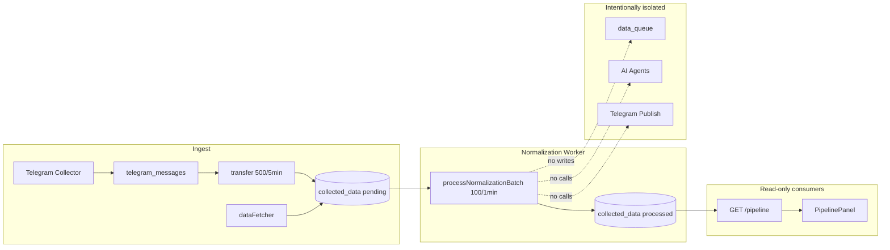

# DataHub Normalization Worker (DH-NORMALIZATION-P0-WORKER-1)

Production normalization engine: `pending` → normalize → validate → quality score → `processed`.

**Does not:** enqueue `data_queue`, run AI agents, Telegram publish, automation dispatch, or trades.

---

## Phase A — Dependency map

### Reads `collected_data`

| Consumer | Purpose |
|----------|---------|
| `normalizationWorker.js` | **Writer (this task)** — pending rows |
| `buildDataPipelineView()` | Pipeline tab metrics + preview |
| `datahubAutomationService` | Queue refresh reads pipeline preview only |
| `collected-data` routes | List/filter API |
| `data-sources` routes | Per-source collected view |
| `dataFetcher` / `telegramPipeline` | Insert only |
| `deduplicationService` | Duplicate detection |
| `datahubDiscoveryService` | Discovery signals |

### Writes `collected_data`

| Writer | Fields |
|--------|--------|
| `dataFetcher` | `raw_data`, `status=pending` |
| `telegramPipeline` | `raw_data`, envelope `normalized_data`, `pending` |
| `datahubCrawlersService` | raw + partial normalized, `pending` |
| `collected-data` API | Manual create/update |
| **`normalizationWorker`** | `normalized_data` v1, `quality_score`, `processed`, `processed_at` |
| `dataPipeline.processItem` | Legacy path with agents (**not scheduled**) |

### `data_queue`

| Action | Component |
|--------|-----------|
| **Insert** | `dataPipeline.processItem` only (unscheduled) |
| **Read/consume** | No production consumer found |

### APIs exposing normalization status

| Endpoint | Metrics |
|----------|---------|
| `GET /api/v1/data-sources/pipeline` | `pending24h`, `passed24h`, `failed24h`, `normalizedPercent`, `normalizationSummary` |
| `GET /api/v1/collected-data` | `status`, `normalized_data`, filters |

### UI dependencies

| Component | Fields |
|-----------|--------|
| `PipelinePanel` | `normalizationSummary`, `normalizedData[]`, `qualityScore`, pending/passed metrics |
| `CollectedDataPanel` | `status`, `normalized_data` |
| `QueuePreviewModal` | `qualityScore` from automation queue (not worker-triggered) |

### PM2 / scheduler

| Process | Role |
|---------|------|
| `titan-engine-worker` | `engineWorkerLeader` → `scheduler.start()` if `SCHEDULER_ENABLED=true` |
| `titan-backend` | API + optional `routes/scheduler.js` |
| `telegram-collector` | Ingest only |
| `telegram-processor` | `processed_telegram_messages` (separate from DataHub) |

### Redis

Not used by normalization worker. Health check only.

### Scheduler jobs (after this task)

| Job | Interval | Function |
|-----|----------|----------|
| Data fetch | 2 min | `runDataFetchJob` |
| Telegram transfer | 5 min | `transferTelegramMessagesToPipeline(500)` |
| **Normalization** | **1 min** | **`processNormalizationBatch(100)`** |
| Agents / Artemis / etc. | various | unrelated |



---

## Phase B — Worker design

| Control | Value |
|---------|-------|
| Batch size | 100 (`NORMALIZATION_DEFAULT_BATCH`) |
| Sub-batch TX | 25 rows |
| Interval | 60s via `scheduler.config.normalization` |
| Advisory lock | `8392742` |
| In-memory lock | single-flight per process |
| Row isolation | `SAVEPOINT` per row |
| Version | `dh-norm-worker-1` |

Files:

- `backend/services/normalizationWorker.js`
- `backend/services/normalizationQualityScorer.js`
- `backend/engine/scheduler.js` → `startNormalizationScheduler()`

---

## Phase C — Processing flow

Per `status=pending` row:

1. Normalize (`dataNormalizer` → v1 contract)
2. Validate (`dataValidator.validateContract`)
3. Quality score (`normalizationQualityScorer`)
4. `UPDATE normalized_data`, `status=processed`, `processed_at=NOW()`
5. On validation fail → `status=error`, `error_message`
6. On exception → `status=error` (savepoint rollback)

---

## Phase D — Quality scoring

| Band | Score | `quality_warning` |
|------|------:|-------------------|
| Excellent | 90–100 | false |
| Good | 75–89 | false |
| Acceptable | 50–74 | false |
| Weak | 25–49 | true |
| Poor | 0–24 | true |

Stored in `normalized_data.metadata.quality_score`, `quality_band`, `quality_warning`.

Pipeline preview reads `quality_score` via `dataPipelineSnapshot.resolveQualityDisplay()`.

---

## Phase E — Verification results (2026-06-05, local `titangold_db`)

### Before

| pending | processed | errors |
|--------:|------------:|-------:|
| 348 | 0 | 0 |

### Batch runs

| Batch | selected | processed | errors | duration | rows/sec |
|------:|---------:|----------:|-------:|---------:|---------:|
| 100 | 100 | 100 | 0 | 136ms | 735 |
| 500 | 248 | 233 | 15 | 266ms | 876 |
| 1000 | 0 | 0 | 0 | 2ms | — |

### After

| pending | processed | errors | normalized % |
|--------:|----------:|-------:|-------------:|
| 0 | 333 | 15 | 100% |

### Pipeline API (`buildDataPipelineView`)

```json
{
  "totalRecords": 348,
  "normalizedPercent": 100,
  "pending24h": 0,
  "passed24h": 7,
  "normalizationSummary": {
    "totalProcessed": 348,
    "passed": 333,
    "warnings": 0,
    "rejected": 15
  }
}
```

### Error analysis

All 15 errors: `content is required and must be non-empty after trim` — RSS/API rows with empty body. Rows marked `error`, not dropped.

### Safety checks

- No `data_queue` inserts from worker
- No Telegram publish / automation side effects
- No duplicate re-processing (pending-only selection)
- Advisory lock prevents overlapping runs

---

## Phase F — Pipeline metrics (real SQL)

Updated `dataPipelineSnapshot.js`:

- **passed** = `status=processed` AND `normalized_data IS NOT NULL`
- **warnings** = processed + `metadata.quality_warning` or band weak/poor
- **rejected** = `status=error`
- **normalizedPercent** = rows with `normalized_data` / total
- Recent preview ordered by `processed_at DESC`

---

## Migration

`036_collected_data_pending_index.sql` — partial index on `(collected_at) WHERE status='pending'`.

---

## Rollback

1. Revert commit; `pm2 reload titan-engine-worker`
2. Processed rows remain valid; no delete required
3. Drop index optional: `DROP INDEX IF EXISTS idx_collected_data_pending_collected`

---

## Observability

- Structured log: `Normalization worker batch completed`
- `getNormalizationWorkerStats()` — last run in-memory
- `getNormalizationBacklogStats()` — pending/processed counts
