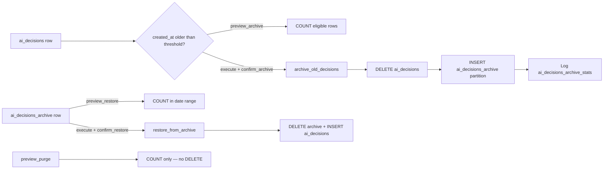

# DH-DATA-ARCHIVING-P1 — Comprehensive RCA Audit

Date: 2026-06-27  
Task: `DH-DATA-ARCHIVING-P1-COMPREHENSIVE-RCA-AUDIT`  
Branch: `feat/gap-008-sources-backend-wiring` · commit `b557af0`  
Environment: dev DB on server (`ubuntu`)  
Scope: **Read-only audit** — no code changes, no DB mutations, no archive/restore/purge execution, no commit.

Contract reference: [`advanced/ARCHIVING_API_CONTRACT.md`](./advanced/ARCHIVING_API_CONTRACT.md)  
Design reference: [`DESIGN_SYSTEM_DATAHUB.md`](../../DESIGN_SYSTEM_DATAHUB.md)

---

## Final Verdict

### **FUNCTIONAL BUT OUTDATED**

| Layer | Assessment |
|-------|------------|
| Backend API + SQL functions | **Functional** — GET endpoints 200; health/stats match DB |
| Data mutation path (archive/restore) | **Implemented but unverified in runtime** — 0 rows ever archived on this DB |
| UI/UX | **Outdated** — pre–design-system layout; raw partition/operation labels |
| Scheduler | **Partial** — maintenance scheduler can call `archive_old_decisions(90)`; no dedicated archive worker/cron in UI; last successful stats run 2026-05-11 |
| Security | **PARTIAL** — confirms + RBAC on mutating routes; preview POSTs write audit rows; purge apply disabled (v3.0) |

**Closing phrase:** Data Archiving remains **FUNCTIONAL BUT OUTDATED**. No code or DB changes were made in P1.

Human QA suspicion of a “broken backend” is **not supported** — stats, health warning, and pending counts are **accurate**. The module looks broken mainly because **nothing has been archived yet**, **warning text is raw SQL**, and **internal DB names are shown verbatim**.

---

## Phase 0 — Repo / Scope Safety

| Item | Value |
|------|-------|
| Git branch | `feat/gap-008-sources-backend-wiring` |
| Git commit (HEAD) | `b557af0` |
| Dirty/untracked files before audit | **60** (unrelated WIP — AccessControl, Pipeline, Notifications, etc.) |
| Files modified during P1 | **0** (audit only) |
| Destructive ops executed | **None** |
| Safe GET calls | Yes — archiving GET endpoints only |
| POST preview calls in audit | **Not executed by auditor** (browser session may have prior human preview rows) |

Evidence: `docs/ssot_v3/screenshots/archiving-p1-browser-evidence.json`

---

## Phase 1 — Feature Purpose (Plain English)

### What Data Archiving is supposed to do

Move **old AI decision records** from the hot table `ai_decisions` into **cold storage** `ai_decisions_archive` (yearly PostgreSQL partitions), with optional **restore** back to active storage. **Purge delete is preview-only in v3.0.**

| Question | Answer |
|----------|--------|
| What data does it archive? | Rows in **`ai_decisions`** older than a day threshold (default 90) |
| AI decisions only? | **Yes** — scope is `ai_decisions` / `ai_decisions_archive` only |
| Related to collected_data / Pipeline / Automation / Telegram? | **No** — not in GAP-032 contract; those modules are separate |
| Source table | `ai_decisions` |
| Archive target | `ai_decisions_archive` (+ partitions `ai_decisions_archive_YYYY`) |
| Pending archive | Count of `ai_decisions` rows with `created_at < now - 90 days` (fixed 90d in health SQL) |
| Archive old decisions | Run `archive_old_decisions(days)` — **DELETE from source + INSERT into archive** in one transaction (CTE) |
| Restore from archive | Run `restore_from_archive(start, end)` — **DELETE from archive + INSERT into ai_decisions** |
| Purge preview | Count rows in archive matching optional date filter — **no delete** in v3.0 |
| “No cron or auto-delete in v3.0” | Product lock: UI copy + no purge apply endpoint; scheduling is manual via UI or ops scripts (GAP-033 open) |

### Flow (implemented steps only)



---

## Phase 2 — Frontend Audit

### Files

| Role | Path |
|------|------|
| Main UI | `components/ai/AIManager/tabs/DataHub/advanced/Archiving.tsx` |
| Tab host | `components/ai/AIManager/tabs/DataHub/AdvancedFeatures.tsx` |
| API client | `services/dataHubArchivingApi.ts` |
| React Query hooks | `hooks/useDataHubArchiving.ts` |
| Permissions | `components/ai/AIManager/tabs/DataHub/hooks/useDataHubPermissions.ts` |
| Shared UI | `components/ai/AIManager/tabs/DataHub/dataHubUi.tsx` (`DataHubAlert`, `dataHubWriteGate`) |
| Locales | `deploy/blue|green/locales/en.json`, `fa.json` (`archiving_*`, `data_archiving`) |

### State management

- `@tanstack/react-query`: `useArchiveStatsQuery`, `useArchivedRecordsQuery`, mutations for preview/execute.
- Local state: `daysOld`, previews, confirm modals, restore date inputs.

### UI action map

| Button label | Enabled when | Handler | Endpoint | Payload | Read-only? | Mutates data? | Confirm |
|--------------|--------------|---------|----------|---------|------------|---------------|---------|
| **Dry run** (archive) | `!busy` | `previewArchiveMut` | `POST /archive/preview` | `{ days_old }` | Count only | **No** row move; **writes audit row** | No |
| **Apply archive** | `canWrite && !busy` | confirm modal → `executeArchiveMut` | `POST /archive` | `{ days_old, confirm_archive: true }` | No | **Yes** — moves rows | Modal + `confirm_archive` |
| **Dry run** (restore) | dates set, `!busy` | `previewRestoreMut` | `POST /restore/preview` | `{ start_date, end_date }` | Count only | Audit row only | No |
| **restore** | `canWrite`, dates set | confirm modal → `executeRestoreMut` | `POST /restore` | `{ start_date, end_date, confirm_restore: true }` | No | **Yes** | Modal + `confirm_restore` |
| **Count purge candidates** | `!previewPurgeMut.isPending` | `previewPurgeMut` | `POST /purge/preview` | `{}` | Count only | Audit row only | No |
| Page load | auto | `useArchiveStatsQuery` | `GET /stats` | — | Yes | No | — |
| Archived table | auto | `useArchivedRecordsQuery` | `GET /records` | — | Yes | No | — |

### Disabled buttons (browser user `p4verify2@test.local`)

| Control | Disabled reason | Correct? |
|---------|-----------------|----------|
| Apply archive | `dataHubWriteGate` — not admin/trader | **Yes** |
| restore | RBAC + empty restore dates | **Yes** |
| Restore dry run | Empty datetime fields | **Yes** |
| Archive dry run | Enabled for read-only user | **Misleading** — backend requires admin/trader (`403` expected) |
| Count purge candidates | Enabled for read-only user | Same — POST requires write role |

### Dry-run vs apply separation

- **Backend:** clear — preview routes count only; apply requires `confirm_*` literals.
- **Frontend:** modals for apply; preview buttons not RBAC-gated (only apply is).

### Raw labels in UI

| Visible text | Source | Type |
|--------------|--------|------|
| `ai_decisions_archive_2024/2025/2026` | `list_archive_partitions()` → rendered in table column | **B + D** — real partition child tables shown as raw internal names |
| `preview_archive`, `preview_purge`, `preview_restore` | `datahub_archiving_operations.operation_type` | **Internal enum** — not i18n mapped |
| `WARNING: Archive not run in >30 days` | `check_archive_health().status` SQL string | **Raw backend message** — not localized |

**Not** missing i18n keys — labels like `archiving_*` resolve correctly in EN.

---

## Phase 3 — Backend Route Audit

Mount: `/api/v1/data-hub/archiving` (`backend/routes/v1/index.js`)

| Method | Path | Auth | RBAC mutate | Class | Mutates DB | Notes |
|--------|------|------|-------------|-------|------------|-------|
| GET | `/health` | JWT | — | SAFE GET | No | `check_archive_health()` |
| GET | `/partitions` | JWT | — | SAFE GET | No | |
| GET | `/stats` | JWT | — | SAFE GET | No | Dashboard bundle |
| GET | `/operations` | JWT | — | SAFE GET | No | |
| GET | `/records` | JWT | — | SAFE GET | No | Paginated archive read |
| POST | `/archive/preview` | JWT | admin/trader | SAFE DRY-RUN* | Audit insert only | *writes `datahub_archiving_operations` |
| POST | `/archive` | JWT | admin/trader | MUTATING ARCHIVE | Yes | Needs `confirm_archive: true` |
| POST | `/restore/preview` | JWT | admin/trader | SAFE DRY-RUN* | Audit only | |
| POST | `/restore` | JWT | admin/trader | MUTATING RESTORE | Yes | Needs `confirm_restore: true` |
| POST | `/purge/preview` | JWT | admin/trader | SAFE DRY-RUN* | Audit only | Count only; no purge apply route |
| POST | `/partitions` | JWT | admin/trader | MUTATING | DDL | `confirm_create: true`; **not exposed in UI** |

Schemas: `backend/schemas/datahubArchivingSchemas.js`  
Errors: 400 confirm codes, 403 unauthorized, 500 on SQL failure.

---

## Phase 4 — Backend Service Audit

**Main file:** `backend/services/datahubArchivingService.js`

| Concern | Implementation |
|---------|----------------|
| Eligibility | `previewArchive`: `COUNT(*) FROM ai_decisions WHERE created_at < now - days` |
| Archive apply | `SELECT * FROM archive_old_decisions($days)` |
| Restore preview | Count in `ai_decisions_archive` date range |
| Restore apply | `restore_from_archive(start, end)` |
| Purge preview | `COUNT(*)` on archive; `purge_apply_available: false` |
| Partitions | `list_archive_partitions()` |
| Stats | `check_archive_health()`, `ai_decisions_archive_stats`, `datahub_archiving_operations` |
| Transactions | SQL functions use CTE DELETE+INSERT (atomic within function) |
| Audit | Every preview/apply logs to `datahub_archiving_operations` |
| Batch limit | **None** in API — full eligible set in one function call |
| Concurrent lock | Shell script has lock file; **API has no lock** |
| Idempotency | Re-archive same row impossible after delete; restore can **fail on PK conflict** if ID exists in `ai_decisions` |
| Dry-run default | Apply defaults `dry_run: false` in schema — **must pass confirm or dry_run explicitly** |

---

## Phase 5 — Database Audit (Read-only)

### Objects

| Object | Type | Purpose |
|--------|------|---------|
| `ai_decisions` | table | Hot storage (source) |
| `ai_decisions_archive` | partitioned table | Cold storage |
| `ai_decisions_archive_2024/2025/2026` | **physical partitions (B)** | Yearly RANGE partitions |
| `ai_decisions_all` | view | UNION active + archive |
| `ai_decisions_archive_stats` | table | SQL job history from `archive_old_decisions` |
| `datahub_archiving_operations` | table | API audit (migration 033) |
| Functions | `archive_old_decisions`, `restore_from_archive`, `check_archive_health`, `list_archive_partitions`, `create_archive_partition` | `backend/database/extra_scripts/archive_maintenance.sql` |

Migrations: `008_create_archive_tables.sql`, `033_create_datahub_archiving_operations.sql`

### Counts (2026-06-27 audit)

| Metric | Value |
|--------|-------|
| `ai_decisions` total | **12** |
| `ai_decisions_archive` total | **0** |
| Eligible (>90 days) | **4** |
| Pending (health function, 90d fixed) | **4** |
| Oldest active | 2026-02-10 |
| Newest active | 2026-06-18 |
| Partition rows (each) | **0** / 0 bytes |
| `datahub_archiving_operations` | **5** (all preview_*) |
| Last `ai_decisions_archive_stats` | 2026-05-11, **0 records**, success |

### Partition name display answer

**A + B + D:** Names are **real PostgreSQL partition child tables**, created in migration 008. UI renders `partition_name` **directly** without friendly mapping — not i18n keys, not views.

### Known SQL bug (display)

`list_archive_partitions()` regex for `end_date` returns duplicate/wrong values (start repeated). UI “Size 0 bytes” is correct for empty partitions.

---

## Phase 6 — Scheduler / DevOps

| Check | Finding |
|-------|---------|
| PM2 archive worker | **None** |
| User cron | **None** for archive |
| systemd timers | **None** for archive |
| `archive-old-decisions.sh` | Exists — **ops manual/cron template**, not wired to UI |
| Backend maintenance scheduler | `backend/engine/scheduler.js` → `maintenanceService.runFullSiteMaintenance()` may call `archive_old_decisions(90)` when `maintenance.autoRun` enabled |
| UI scheduler | **None** — manual-only by design (GAP-033) |
| Last archive run marker | `ai_decisions_archive_stats.archive_date` — **2026-05-11** (47 days ago) |
| `>30 days` warning | **Accurate** — from `check_archive_health()` comparing `last_archive_date` to `CURRENT_DATE - 32 days` |
| Daily stats rows May 7–11 | Consistent with maintenance calling `archive_old_decisions` daily with **0 eligible rows** at that time |

**Note:** Archiving is **not purely manual** at the infrastructure level if maintenance scheduler runs — but **UI does not control it** and product copy says manual-only for v3.0 operator actions.

---

## Phase 7 — Security / Safety

| Control | Status |
|---------|--------|
| Auth on all routes | **Yes** |
| RBAC admin/trader on POST | **Yes** |
| `confirm_archive` / `confirm_restore` | **Required literal true** |
| Purge apply | **Not implemented** (v3.0) |
| Dry-run default on apply | **No** — explicit confirm required |
| Batch limits | **Missing** — large moves in one transaction |
| API direct delete without UI | **Archive/restore possible via API** with JWT + confirm — no second factor |
| Sensitive fields | `input_data` / `output_data` JSONB moved intact — **no masking** |
| Recovery | Restore path exists; no automatic backup hook |

**Security verdict: PARTIAL** — confirms and RBAC are sound; missing batch caps, no API lock, restore duplicate-ID risk, preview POST allowed without frontend RBAC hint.

---

## Phase 8 — Runtime / API Audit (Safe GET only)

| Endpoint | Status | Latency | Notes |
|----------|--------|---------|-------|
| GET `/health` | 200 | 84ms | status warning matches UI |
| GET `/stats` | 200 | 63ms | active=12, archived=0, pending=4 |
| GET `/partitions` | 200 | 13ms | 3 partitions, 0 rows each |
| GET `/records?limit=5` | 200 | 19ms | empty list |
| GET `/operations?limit=5` | 200 | 11ms | preview_* only |

**UI mismatch during load:** Brief flash of zeros before stats resolve (no skeleton — looks broken for ~1–4s).

POST preview endpoints **not called** by auditor (audit-log writes).

---

## Phase 9 — Browser UI Audit

Path verified: **DataHub → Advanced Features → Data Archiving**

| Check | Result |
|-------|--------|
| Page loads | **Yes** |
| Network | GET stats/records **200** (inferred from populated metrics) |
| Console errors | **None observed** |
| Raw i18n keys | **None** (`archiving_*` resolved) |
| Raw internal labels | **Yes** — partition table names + `preview_*` operation types |
| Disabled buttons | Apply/restore disabled for read-only user — **expected** |
| Empty states | “No archived records yet” — **correct** |
| Status | `WARNING: Archive not run in >30 days` — **matches API** |
| Mutating clicks in audit | **None** |

Evidence: `docs/ssot_v3/screenshots/archiving-p1-browser-evidence.json`

---

## Phase 10 — Design System Audit

Reference: Telegram Collector / post-P3 Automation patterns vs current `Archiving.tsx` custom shell.

| Criterion | Result | Notes |
|-----------|--------|-------|
| Layout | **FAIL** | No lifecycle explainer card; flat sections |
| Spacing | **PARTIAL** | Uses some gradient cards; inconsistent with redesigned tabs |
| Cards | **PARTIAL** | Metric cards OK; tables unstyled vs `DataHubEmpty` / `StatusPill` patterns |
| Badges | **FAIL** | Raw SQL status string instead of `StatusPill` + i18n |
| Typography | **PARTIAL** | Mixed `text-[11px]` — OK but not aligned with Automation header pattern |
| Loading | **FAIL** | No skeleton; initial zero flash |
| Empty state | **PARTIAL** | Text-only table empty rows |
| Error state | **PARTIAL** | `DataHubAlert` for query errors only |
| Accessibility | **FAIL** | Restore datetime inputs unlabeled; status not announced |
| Dark theme | **PASS** | Slate gradient shell |
| Responsive | **PASS** | Grid collapses |

**Overall design: FAIL / OUTDATED**

### P2 redesign needs (document only)

1. Top explanation + lifecycle diagram card  
2. Human-readable status badge (map SQL status → i18n)  
3. Partition table: friendly year labels + hide internal table names  
4. Operations timeline with translated operation types  
5. RBAC-aware disable + tooltip on preview POST buttons  
6. Loading skeleton for stats  
7. Safety panel for purge (count-only) and confirm UX aligned with Automation Routing  
8. Align with `dataHubUi` primitives (`MetricCard`, `StatusPill`, `ActionButton`)

---

## Phase 11 — Cross-Module Dependencies

| Module | Dependency | Risk |
|--------|------------|------|
| **AI Decisions / Decision Engine** | **Direct** — archives `ai_decisions` | Archive removes rows from hot table — analytics on active table only sees recent data unless `ai_decisions_all` used |
| **Artemis Decision Engine** | **Indirect** | Historical decision queries may miss archived rows |
| **Backtesting / Analytics** | **Possible** | If queries hit `ai_decisions` only, archived data invisible |
| **Data Pipeline / collected_data** | **Not dependent** | Out of scope |
| **Automation Routing** | **None** | |
| **Telegram Publisher** | **None** | |
| **Access Logs / Health** | **None** | |
| **Backup/restore** | **Ops** | Archive complements but separate from DB backup |
| **Maintenance scheduler** | **Hidden coupling** | Can auto-run `archive_old_decisions` — contradicts “manual-only” UX message |

---

## Phase 12 — Findings Summary

### What works

- GET API mounted and fast (<100ms)  
- Health math correct (12 active, 4 pending, 0 archived, 47-day warning)  
- SQL archive/restore functions exist with transactional CTE move  
- Confirm gates on apply archive/restore  
- Purge is count-only (safe)  
- i18n for main section labels (EN verified in browser)

### What is UI-only / presentation

- Raw partition names and `preview_*` operation types  
- Raw SQL warning string in status badge  
- Outdated layout vs redesigned DataHub advanced tabs  
- Initial load zero flash  
- Read-only users see enabled preview buttons that will 403

### What is broken

- **`list_archive_partitions()` end_date parsing** — wrong/end duplicate in API  
- **Not end-to-end verified:** zero rows ever archived via UI or recorded stats with `records_archived > 0`

### What is merely outdated

- Component structure predates design-system pass (SSOT still marks “Design: Done” from GAP-032 — **stale vs current bar**)

### What is unsafe (partial, not BLOCKER)

- No batch limit on archive/restore  
- Restore without duplicate-ID guard  
- Preview POST requires write role but UI does not gate  
- `input_data`/`output_data` not redacted in archive read API

---

## Phase 13 — Recommended P2 Plan (Do not implement in P1)

### A. Functional fix

1. Fix `list_archive_partitions()` date parsing  
2. Map `health.status` → stable codes + i18n labels  
3. Map `operation_type` → human labels in UI  
4. Gate preview POST buttons with `canWrite` + tooltip  
5. Add loading skeleton for stats  
6. Optional: align pending count slider with health (90d fixed vs user slider)

### B. Safety hardening

1. Batch size limit in `archive_old_decisions` / API  
2. Restore `ON CONFLICT DO NOTHING` or pre-check duplicates  
3. Advisory lock for concurrent archive  
4. Document maintenance scheduler interaction with “manual-only” copy

### C. UI/UX redesign

1. Redesign `Archiving.tsx` per `DESIGN_SYSTEM_DATAHUB.md` (Automation Routing quality bar)  
2. Friendly partition labels (`2024`, `2025`, `2026`)  
3. Operations timeline component  
4. Safety/confirm panels

### D. DevOps / scheduler decision

1. Close GAP-033 — either wire cron + UI status or disable maintenance auto-archive  
2. Document ops path: `archive-old-decisions.sh` vs UI  
3. Alert when pending > 0 for N days

### E. Browser verification

1. Admin user: dry-run preview → confirm apply on test row → verify counts  
2. Restore round-trip on fixture range  
3. Purge preview count-only proof  
4. EN/FA label pass

### F. Production preview verification

1. Dry-run only on prod with admin JWT  
2. Compare UI stats vs SQL counts  
3. No apply until operator sign-off

### G. Final commit plan (future)

Scoped commits: `fix(datahub): archiving partition labels and health i18n` → `feat(datahub): redesign archiving tab` → `docs: archiving P2 verify SSOT`

---

## Service Call Graph

```text
Archiving.tsx
  → useArchiveStatsQuery → GET /stats
      → getArchivingDashboard
          → getArchiveHealth()        → check_archive_health()
          → listArchivePartitions()   → list_archive_partitions()
          → listArchiveSqlStats()     → ai_decisions_archive_stats
          → listArchivingOperations() → datahub_archiving_operations
  → useArchivedRecordsQuery → GET /records → listArchivedRecords()
  → previewArchive → POST /archive/preview → previewArchive() → INSERT audit + COUNT
  → executeArchive → POST /archive → executeArchive() → archive_old_decisions()
  → previewRestore / executeRestore → restore_from_archive()
  → previewPurge → COUNT only
```

---

## Evidence Index

| Artifact | Path |
|----------|------|
| Browser evidence JSON | `docs/ssot_v3/screenshots/archiving-p1-browser-evidence.json` |
| API contract | `docs/ssot_v3/advanced/ARCHIVING_API_CONTRACT.md` |
| Frontend | `components/ai/AIManager/tabs/DataHub/advanced/Archiving.tsx` |
| Backend routes | `backend/routes/data-hub-archiving.js` |
| Backend service | `backend/services/datahubArchivingService.js` |
| SQL functions | `backend/database/extra_scripts/archive_maintenance.sql` |

---

**Data Archiving remains FUNCTIONAL BUT OUTDATED. No code or DB changes were made in P1.**
