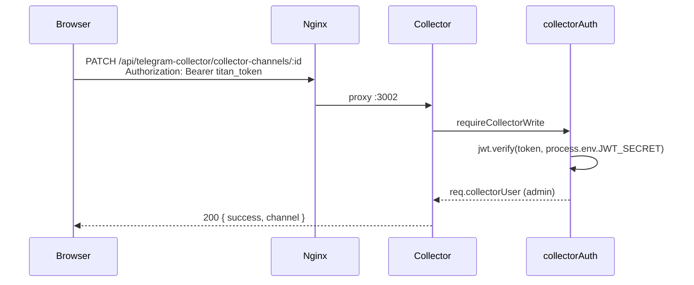

# DH-TELEGRAM-COLLECTOR-P7.2 — Write Auth Hotfix

**Phase:** P7.2  
**Status:** REAL WORKING  
**Scope:** Telegram Collector write authentication only — no UI redesign.

---

## Human QA report

After P7 closure, **all Telegram Channels write actions** failed with:

```text
Invalid or expired token
```

Read operations (channel list, health, analytics tabs) continued to work.

Affected actions:
- Link to Source (backend — separate path; collector writes were primary failure)
- Change Priority
- Enable/Disable Polling
- Assign Account
- PATCH/POST on `/api/telegram-collector/*`

---

## Phase 1 — RCA / Request trace

### Reproduction (local collector `127.0.0.1:3002`)

| Step | Request | Auth header | Status | Body |
|------|---------|-------------|--------|------|
| 1 | `GET /api/telegram-collector/collector-channels` | none | **200** | `{ success, channels[] }` |
| 2 | `PATCH /api/telegram-collector/collector-channels/:id` | `Bearer <admin JWT from PM2 secret>` | **401** | `{ error: "Invalid or expired token" }` |
| 3 | Middleware log | — | — | `[collector-auth] DENY … reason=invalid_signature` |

### Root cause

**JWT secret mismatch between token issuer and collector verifier.**

| Source | Value | Used by |
|--------|-------|---------|
| `process.env.JWT_SECRET` (PM2) | `your-super-secret-jwt-key-…` (56 chars) | **Backend login** — signs browser `titan_token` |
| `backend/.env` file (on disk) | `TitanGold…` (52 chars) | **collectorAuth** — read file **first** (P4 regression) |

P4 intentionally preferred `backend/.env` over `process.env` to fix stale PM2 env, but production PM2 **is** the issuer while `backend/.env` on disk is **stale/different**. Tokens signed with PM2 secret failed signature verification in collector.

Failure point: `telegram-collector/middleware/collectorAuth.js` → `jwt.verify()` → `JsonWebTokenError: invalid signature` → generic 401.

Reads unaffected: GET routes are public; no JWT required.

---

## Phase 2 — Frontend auth audit

All Telegram Channels mutations in `TelegramPanel.tsx` / `useDataHub.ts` already use `getCollectorAuthHeaders()`:

- `PATCH collector-channels/:id` (priority, active, account)
- `POST channels/:id/force-sync`, `test`, `refresh`, `register`
- `PATCH accounts/:id`, `POST logout`

No bypass found for collector writes. **Frontend was correct.**

Link to Source uses `createTelegramDataSource` → backend `/api/v1/data-sources` (backend JWT). Collector fix resolves channel-table mutations.

---

## Phase 3 — Backend fix

**File:** `telegram-collector/middleware/collectorAuth.js`

```javascript
function resolveJwtSecret() {
    if (process.env.JWT_SECRET) {
        return process.env.JWT_SECRET;  // matches PM2 / backend issuer
    }
    // fallback: backend/.env file
}
```

Deny logging unchanged — internal log includes `reason=invalid_signature|token_expired|…` without exposing secrets.

---

## Phase 4 — Write endpoint verification

**Script:** `backend/scripts/telegram-collector-p72-write-auth-verify.mjs`  
**Evidence:** `docs/ssot_v3/screenshots/telegram-collector-p72-write-auth-evidence.json`

| Action | Admin | Viewer / no auth |
|--------|-------|------------------|
| PATCH priority | **200** | 403 (viewer) |
| PATCH is_active | **200** | — |
| POST channels/refresh | **200** | **401** |

---

## Auth flow (final)



---

## Phase 5 — Regression checklist

| Area | Status |
|------|--------|
| Accounts GET | ✓ |
| Channels GET | ✓ |
| Health | ✓ |
| Overview / AI Inbox / Categories / Breaking / Geographic | ✓ (unchanged) |
| Admin writes | ✓ 200 |
| Viewer writes | ✓ 403 |

---

## Tests / DevOps

```
jest telegramCollectorAuth.test.js — 6 passed
node backend/scripts/telegram-collector-p72-write-auth-verify.mjs — REAL WORKING
pm2 restart telegram-collector — applied
```

---

## Final verdict

**REAL WORKING** — Collector writes authenticate against the same JWT secret as the backend issuer. Human QA blocker resolved.

**Commit:** `fix(datahub): align collector JWT secret with backend issuer (P7.2)`

**Telegram Collector:** **PERMANENTLY CLOSED** — see also [P7.2 Write Auth Hotfix](./DH-TELEGRAM-COLLECTOR-P7.2-WRITE-AUTH-HOTFIX.md) for post-closure Human QA fix.
