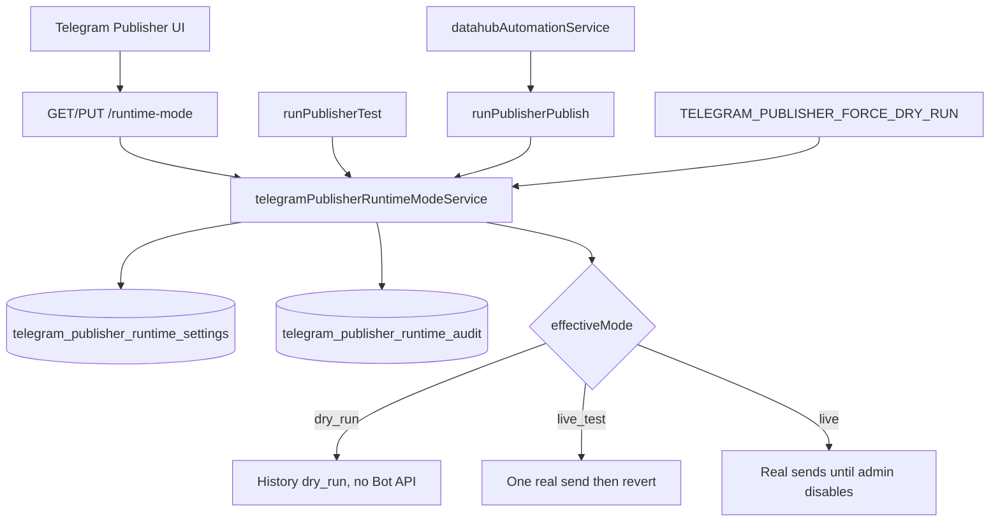

# DH-TELEGRAM-PUBLISHER-P3 — Runtime Live Mode Control

**Task:** `DH-TELEGRAM-PUBLISHER-P3-RUNTIME-LIVE-MODE-CONTROL`  
**Date:** 2026-07-10  
**Verdict:** **TELEGRAM PUBLISHER — REAL WORKING / HUMAN QA ACCEPTED / CLOSED**

---

## Closeout Record

| Item | Value |
|------|-------|
| **Implementation commit** | `51a9a68` |
| **Production index bundle** | `assets/index-BBlvCWrL.js` |
| **Production DataHub bundle** | `assets/DataHubTab-MbvnB3Oa.js` |
| **Human QA** | **ACCEPTED** (2026-07-10) — Publisher Delivery Mode card, mode controls, live labels, real Telegram delivery verified on `https://titan.zala.ir` |
| **Human QA screenshot** | `docs/ssot_v3/screenshots/telegram-publisher-p3-human-qa-after-rebuild.png` |
| **Automated QA evidence** | `docs/ssot_v3/screenshots/telegram-publisher-p3-runtime-evidence.json` |
| **Final production mode** | **`live`** (intentionally left — operator Human QA acceptance; reason: `ریدیزاین`) |
| **Emergency override** | **Inactive** (`TELEGRAM_PUBLISHER_FORCE_DRY_RUN=false`) |
| **Backend persistence check** | After `pm2 restart titan-backend`: `configuredMode=live`, `effectiveMode=live` unchanged |

### Production frontend deployment safeguard

**Root cause of rejected QA:** nginx serves `/home/ubuntu/webapp/TitanGold/dist` (static Vite build). PM2 `titan-frontend` runs `npm run dev` on `:3000` and does **not** deploy production assets.

**Canonical deploy command:**

```bash
./scripts/deploy-production-frontend.sh
```

The script: runs `npm run build`, verifies `dist/index.html` mtime changed, verifies the DataHub bundle contains `publisher_delivery_mode_title`, reloads nginx, fetches production `index-*.js` hash, and **fails** if production still serves an old bundle or missing smoke marker.

**Policy:** `dist/` is **not** tracked in git.

### Release verification rule (mandatory)

No frontend task may be marked **REAL WORKING / CLOSED** until:

1. Production `dist/` is rebuilt via `./scripts/deploy-production-frontend.sh`
2. Production URL is checked (not only `:3000` dev)
3. The new feature is visibly present in a screenshot
4. The deployed bundle identifier (`index-*.js` / `DataHubTab-*.js`) is recorded in SSOT

---

## P1 / P2 Summary

| Phase | Finding | Outcome |
|-------|---------|---------|
| **P1** | Publisher code path healthy; `TELEGRAM_PUBLISHER_DRY_RUN=true` in PM2 forced dry-run | RCA closed — not a code bug |
| **P2** | One controlled live publish with temporary env `DRY_RUN=false` | `telegram_message_id: 205`, live verified, rollback Option A |

**P3 goal:** Remove day-to-day PM2/env edits for live/dry-run switching. Runtime mode stored in DB, auditable, operator-controlled from DataHub UI.

---

## Architecture



### Modes

| Mode | Behavior | Persistence |
|------|----------|-------------|
| `dry_run` | Default; no Telegram API | Until admin changes |
| `live_test` | One real send OR 10 min expiry → auto `dry_run` | Temporary |
| `live` | All valid publish/test sends are real | **Survives PM2/reboot** (DB) |

### Effective mode rules

1. If `TELEGRAM_PUBLISHER_FORCE_DRY_RUN=true` → `effectiveMode=dry_run` (emergency)
2. If `FORCE_DRY_RUN=false` explicitly set → legacy `TELEGRAM_PUBLISHER_DRY_RUN` ignored (Option B)
3. If DB `live_test` expired or `remaining_sends<=0` → auto-revert `dry_run`
4. If DB `live` → `live`
5. Else → `dry_run`

---

## DB Migration

**File:** `backend/database/migrations/048_telegram_publisher_runtime_settings.sql`

Tables:
- `telegram_publisher_runtime_settings` (singleton `id='default'`)
- `telegram_publisher_runtime_audit`

Applied: `2026-07-09` via `run_single_migration.js`.

---

## API Contract

### `GET /api/v1/data-hub/telegram-publishers/runtime-mode`

Returns `configuredMode`, `effectiveMode`, `serverSafetyOverride`, `liveTestExpiresAt`, `liveTestRemainingSends`, `lastChangedBy`, `lastChangedAt`, `reason`, `canChangeMode`, `warnings`, `stats`.

### `PUT /api/v1/data-hub/telegram-publishers/runtime-mode`

Body:
```json
{
  "mode": "dry_run | live_test | live",
  "confirm_runtime_mode_change": true,
  "reason": "string (min 5)",
  "acknowledge_live_delivery_risk": true
}
```

- **Admin only**
- Rejects live/live_test when `SERVER_DRY_RUN_OVERRIDE_ACTIVE`
- Audits every change

### `GET /api/v1/data-hub/telegram-publishers/runtime-mode/audit`

Last 20 audit rows (admin).

Publish/test responses now include: `configuredMode`, `effectiveMode`, `serverSafetyOverride`, `dryRun`, `liveTestConsumed`, `runtimeModeReason`.

---

## Emergency Override (Option B)

| Env | Role |
|-----|------|
| `TELEGRAM_PUBLISHER_FORCE_DRY_RUN=false` | Normal operation — DB controls mode |
| `TELEGRAM_PUBLISHER_FORCE_DRY_RUN=true` | Emergency — forces dry_run, UI disables Live/Live Test |
| `TELEGRAM_PUBLISHER_DRY_RUN=true` (legacy) | Honored **only** when `FORCE_DRY_RUN` is unset |

**ecosystem.config.json:** `TELEGRAM_PUBLISHER_FORCE_DRY_RUN=false` (replaces day-to-day `TELEGRAM_PUBLISHER_DRY_RUN`).

---

## Key Files

| Layer | File |
|-------|------|
| Migration | `backend/database/migrations/048_telegram_publisher_runtime_settings.sql` |
| Service | `backend/services/telegramPublisherRuntimeModeService.js` |
| Publish integration | `backend/services/telegramPublisherService.js` |
| Routes | `backend/routes/telegram-publishers.js` |
| Schemas | `backend/schemas/telegramPublisherSchemas.js` |
| Automation | `backend/services/datahubAutomationService.js` (respects publisher effective mode) |
| Frontend API | `services/telegramPublishersApi.ts` |
| Hooks | `hooks/useTelegramPublishers.ts` |
| UI | `components/ai/AIManager/tabs/DataHub/advanced/TelegramPublisher.tsx` |
| DevOps | `backend/ecosystem.config.json` |

---

## UI

**Card:** Publisher Delivery Mode — configured/effective mode, server override, audit fields, daily stats, three buttons (Dry-run / Live Test 10 min / Live) with modals (reason + acknowledgement for live modes).

**Publish/Test labels** change by `effectiveMode` (dry-run / live test / live helpers).

**Screenshots:**
- Human QA (accepted): `docs/ssot_v3/screenshots/telegram-publisher-p3-human-qa-after-rebuild.png`
- Automated QA: `docs/ssot_v3/screenshots/telegram-publisher-p3-runtime-mode-card.png`

---

## Human QA Acceptance (2026-07-10)

Production UI on `https://titan.zala.ir` verified after `./scripts/deploy-production-frontend.sh` equivalent rebuild:

- Publisher Delivery Mode card visible
- Configured and effective mode displayed
- Enable Dry-run / Live Test / Live controls present
- Publish/test labels reflect effective mode
- Real Telegram delivery confirmed during operator QA

**Rejected QA root cause (resolved):** stale `dist/` bundle `DataHubTab-Dehsvprk.js` served by nginx; dev server on `:3000` had new source but was not production path.

---

## Browser QA Evidence

**Script:** `backend/scripts/telegram-publisher-p3-runtime-browser-verify.mjs`  
**Evidence:** `docs/ssot_v3/screenshots/telegram-publisher-p3-runtime-evidence.json`

| Step | Result |
|------|--------|
| Initial mode dry_run | PASS |
| Dry-run test (no Telegram id) | PASS |
| Enable live_test | PASS |
| Live test send | `telegram_message_id: 209`, `liveTestConsumed: true` |
| Auto-revert dry_run | PASS |
| Enable live | PASS, persists in DB |
| Live send | `telegram_message_id: 210` |
| Rollback dry_run | PASS |
| No browser `api.telegram.org` | PASS |
| Mode card visible | PASS |

**Automated QA rollback:** Script restored `dry_run` after API QA cycle. **Human QA final state:** operator left production in **`live`** mode (accepted).

---

## Security Audit

| Rule | Status |
|------|--------|
| No bot token exposure in API/UI | PASS |
| No frontend `api.telegram.org` | PASS |
| Admin-only mode changes | PASS |
| Audit on mode change + live_test consume | PASS |
| Mapping / ACL / filter / confirm_publish unchanged | PASS |
| Notifications do not own Publisher mode | PASS (unchanged) |
| Collector does not publish | PASS (unchanged) |
| Automation respects Publisher effective mode; `confirm_live` separate | PASS |

---

## Dependency Audit

- **Notifications:** Unchanged — personal alerts separate from Publisher runtime mode.
- **Telegram Collector:** Unchanged — ingest only.
- **Automation Routing:** `runPublisherPublish` uses effective DB mode; automation `dry_run` flag still passed; `confirm_live` unchanged.
- **Data Pipeline:** Unchanged.

---

## Tests / Build

| Suite | Result |
|-------|--------|
| `telegramPublisherRuntimeMode.test.js` | 15 passed |
| `telegramPublisherDelivery.test.js` | 4 passed |
| `src/__tests__/telegramPublisherRuntimeMode.test.ts` | 4 passed |

**Deploy script:** `./scripts/deploy-production-frontend.sh`

---

## Route Fix Note

`PUT /runtime-mode` registered **before** `PUT /:id` to avoid Express treating `runtime-mode` as UUID param.

---

## Final Verdict

**TELEGRAM PUBLISHER — REAL WORKING / HUMAN QA ACCEPTED / CLOSED**

- Runtime mode switches without PM2/env edits for normal operation
- Live mode persists in DB until admin disables (verified after backend restart)
- Live test auto-reverts after one successful send
- Emergency override visible and functional
- Dry-run sends nothing; live/live_test send real Telegram messages
- History `delivery_mode` matches behavior
- Mode changes audited
- Human QA accepted on production URL with rebuilt `dist/`
- Production deployment safeguard script added

**Production mode decision:** **`live`** retained after Human QA acceptance (not rolled back to dry-run).
